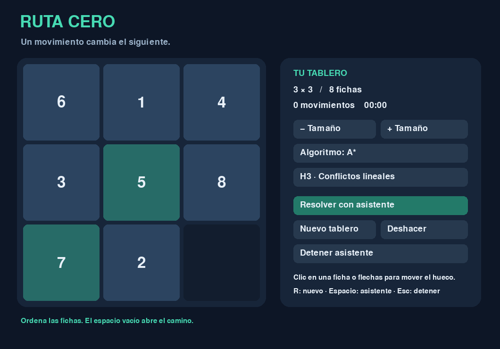
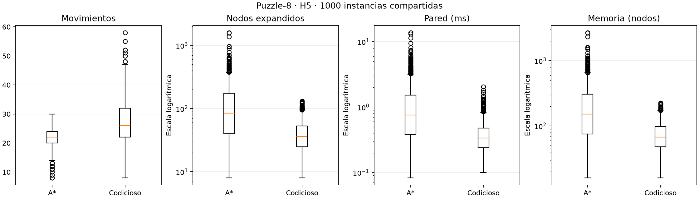

# Puzzle-N: búsqueda informada y comparación de heurísticas

Práctica de Inteligencia Artificial — Msc. Víctor Rodríguez Estévez.

**Fase 8: documentación separada según la aclaración del docente.** Este README es la base del informe: conserva fundamentos, implementación y métricas, y concentra los resultados estadísticos en **Puzzle-8, la selección de H5 y la comparación de A* con Codicioso** (sección 6). Incluye una referencia breve a la aplicación posterior de H5 en tamaños mayores y distingue esa evidencia de la hipótesis aún no comprobada sobre Codicioso.

El [README complementario](README_COMPLEMENTARIO.md) conserva los análisis ampliados, las tablas extensas de todas las configuraciones, los estudios de dificultad y escalabilidad, y el historial de fases y auditorías. Ese contenido queda aislado para no trasladarlo automáticamente al informe según el alcance aclarado. Los datos, gráficos y programas permanecen intactos. Esta reorganización no ejecuta nuevos cálculos ni cambia conclusiones.

La aclaración se aplica al alcance estadístico; no elimina los fundamentos, el código ni los demás entregables de la guía. El informe formal en LaTeX, la presentación de diez minutos y la formalización del repositorio de entrega corresponden a las tareas manuales pendientes del estudiante.

## 1. Problema y objetivos

El puzzle contiene N²−1 fichas y un hueco, representado por cero, en un tablero N×N. Una acción intercambia el hueco con una ficha adyacente arriba, abajo, a la izquierda o a la derecha. Cada movimiento cuesta uno. La meta coloca las fichas de 1 a N²−1 en orden por filas y el hueco al final.

Se pretende implementar y comparar Codicioso y A*, estudiar seis familias de heurísticas, controlar las variables experimentales y explicar la relación entre calidad de solución, esfuerzo de búsqueda y recursos. La práctica incluye un juego en Pygame, un experimento con 1000 instancias compartidas de Puzzle-8 y una exploración de escalabilidad.

La profundidad de una solución es su número de movimientos y coincide con el costo en este problema. Los movimientos usados para mezclar un tablero no son necesariamente su profundidad óptima.

## 2. Fundamentos y relación con el material

Se usan las diapositivas `material/Diapo-IA04Informado.md` y su PDF, los cuadernos `Puzzle_8.ipynb` y `03_agente_buscador.ipynb`, y las clases `AgenteBuscador.py` y `AgenteRK8.py`. La guía se encuentra en `material/guia-practicaIA_puzzleN.md`, contrastada con su PDF. El contenido original no se modifica.

La solución conserva operadores separados del algoritmo, nombres en español, caminos de estados, una frontera y estados visitados. Como en `Puzzle_8.ipynb`, cada estado es una tupla plana e inmutable. Se construye cada hijo intercambiando elementos de una lista temporal; nunca se modifica el padre. La tabla de vecinos se calcula a partir de N, en el orden arriba, abajo, izquierda y derecha del agente proporcionado.

Se adapta el enfoque del docente en vez de importar los ejemplos sin cambios: el paquete `AgenteIA` no viene completo, la clase del cuaderno carece de `set_acciones`, hay sucesores `None`, y los buscadores antiguos usan listas para los visitados. El material posterior recomienda conjuntos y montículos. No se copian las clases de aspiradora ni se agrega una jerarquía que el puzzle no necesita.

En términos REAS: rendimiento = solución y métricas; entorno = tablero; actuadores = movimientos legales; sensores = configuración completa. El asistente es un agente basado en objetivos, con un modelo determinista y totalmente observable del problema.

### 2.1. Conceptos de búsqueda

- `g(n)`: costo desde el inicio.
- `h(n)`: estimación del costo restante.
- `f(n) = g(n) + h(n)`.
- Admisibilidad: `0 ≤ h(n) ≤ h*(n)`, donde `h*` es el costo óptimo restante.
- Consistencia: `h(n) ≤ 1 + h(n')` para cada movimiento legal.

La consistencia y valor cero en la meta implican admisibilidad siguiendo cualquier camino hacia la meta. Con una heurística consistente, A* encuentra una solución óptima si termina sin restricciones de recursos. Codicioso no garantiza optimalidad. En este espacio finito, un fracaso por tiempo o memoria no significa que la instancia sea insoluble ni demuestra incompletitud intrínseca del algoritmo.

### 2.2. Algoritmos implementados

Ambas técnicas utilizan el mismo motor `AgenteBuscador.resolver`. Cambia exclusivamente la prioridad: `h` para Codicioso y `g+h` para A*. `heapq` administra la frontera; un contador de inserción establece desempate FIFO, idéntico para todas las heurísticas. No se compara el contenido del tablero para desempatar.

Un diccionario conserva el mejor costo conocido y un conjunto registra estados cerrados. Se descartan entradas obsoletas del montículo. Si aparece un camino mejor hacia un estado cerrado, se permite reabrirlo y se contabiliza; esto es especialmente relevante en Codicioso. Los nodos conservan referencias a su padre para reconstruir el camino exacto de la entrada aceptada, sin copiar caminos completos en cada generación.

La meta se acepta al extraerla de la frontera. No se generan sus hijos. Se valida el tablero y se comprueba su solubilidad antes de buscar. Para N impar se requiere paridad par de inversiones, excluyendo el hueco; para N par, la suma de inversiones y fila del hueco contada desde abajo debe ser impar, para la meta fijada.

## 3. Heurísticas: definición y justificación

Todas excluyen el hueco de las distancias de fichas. Las posiciones objetivo dependen de N. Ninguna consulta el oráculo de distancias exactas empleado en las pruebas.

### H1. Fichas fuera de lugar

`H1(s) = Σ [posición_s(v) ≠ posición_meta(v)]`, para `v ≠ 0`.

Cada ficha incorrecta debe moverse al menos una vez. Un movimiento cambia la condición de una sola ficha, por lo que H1 cambia como máximo en uno: es admisible y consistente.

### H2. Distancia Manhattan

`H2(s) = Σ (|fila_s(v) − fila_meta(v)| + |col_s(v) − col_meta(v)|)`.

Cada movimiento desplaza una ficha una unidad en un eje. Ignorar las otras fichas relaja el problema; la suma es una cota inferior y cambia exactamente en una unidad por movimiento. Es consistente y domina H1. Se precalculan únicamente las distancias geométricas ficha–posición, no resultados de búsqueda.

### H3. Manhattan más conflictos lineales sin sobreconteo

La definición literal de la guía suma todos los pares invertidos. Se autorizó corregirla para preservar admisibilidad y consistencia. Por ejemplo:

```text
3 1 2       0 1 2
0 5 6   →   3 5 6
4 7 8       4 7 8
```

Contar ambos pares `(3,1)` y `(3,2)` daría 11 antes del movimiento y 8 después, incumpliendo `11 ≤ 1+8`.

Para cada fila se toman, en orden actual, las columnas objetivo de las fichas que pertenecen a esa fila. Si la secuencia tiene longitud L y su subsecuencia estrictamente creciente más larga tiene longitud LIS, se requieren al menos `L−LIS` fichas que abandonen esa fila para resolver su orden. Se hace el cálculo análogo por columna.

`C_corregido(s) = Σ_filas (L−LIS) + Σ_columnas (L−LIS)`

`H3(s) = H2(s) + 2 C_corregido(s)`

**Admisibilidad.** Las fichas que permanecen en una línea no pueden invertir su orden sin que alguna salga. Cada ficha que debe salir de su línea objetivo y regresar añade al menos dos movimientos en el eje perpendicular, no incluidos en su Manhattan de ese eje. Las penalizaciones de filas corresponden a desplazamientos verticales y las de columnas a horizontales.

**Consistencia.** Insertar o eliminar un elemento cambia `L−LIS` como máximo en uno. Al sacar una ficha de su fila objetivo, Manhattan aumenta uno y la penalización de esa fila puede bajar a lo sumo dos. Al entrar, Manhattan baja uno y la penalización no puede disminuir. Las fichas restantes mantienen su orden. El argumento es simétrico para columnas; por tanto, H3 no puede disminuir más de uno por movimiento. En la meta vale cero.

### H4. Mejora de esquinas mediante abstracciones consistentes

La frase de la guía sobre esquina incorrecta y hueco en la esquina opuesta no especifica un costo demostrable. Aplicar una penalización activada o desactivada por esa condición puede introducir saltos y contar trabajo ya incluido en H3. Se adopta una **reformulación explícita**, apoyada en problemas relajados y en el máximo de heurísticas de las diapositivas.

Para cada esquina cuya meta contiene una ficha se construye un patrón P con esa ficha y las de sus dos casillas vecinas objetivo. En Puzzle-8 son `{1,4,2}`, `{3,6,2}` y `{7,4,8}`. El patrón conoce las posiciones de sus fichas y del hueco; las otras fichas son indistinguibles.

La distancia abstracta `D_P` cobra uno cuando se mueve una ficha de P y cero cuando se mueve una ficha ajena. Se combina con Manhattan de las fichas restantes:

`B_P(s) = D_P(s) + Manhattan_fichas_fuera_de_P(s)`

`H4(s) = max(H3(s), max_P B_P(s))`

Equivalentemente, `H4 = H3 + E`, con `E(s) = max(0, max_P B_P(s) − H3(s))`.

**Justificación.** Las distancias exactas en cada abstracción satisfacen la desigualdad triangular respecto de los costos 0/1. Un movimiento cobra costo en el patrón o en Manhattan del complemento, nunca en ambos. Cada B es consistente para costo real uno. El máximo de funciones consistentes también es consistente y vale cero en la meta. Los patrones de esquinas pueden solaparse porque sus valores se combinan mediante máximo, no mediante suma.

H4 domina H3. E es el incremento residual demostrado, no una penalización constante por ficha de esquina incorrecta; no se impone el interruptor informal sobre la esquina opuesta. Esta diferencia con la redacción de la guía queda documentada y evita afirmar propiedades falsas.

### H5. Bases de patrones disjuntos aditivas

En Puzzle-8 se utilizan `{1,2,3,4}` y `{5,6,7,8}`:

`H5(s) = D_{1,2,3,4}(s) + D_{5,6,7,8}(s)`.

Las PDB se construyen desde la meta abstracta mediante búsqueda 0-1 con `deque`. El estado abstracto contiene hueco y posiciones de las fichas del patrón. Solo mover una ficha del patrón cuesta uno. Las aristas son reversibles con el mismo costo.

**Justificación.** En cada movimiento real exactamente uno de los patrones cobra uno y los restantes cobran cero. Sumando sus desigualdades triangulares se obtiene consistencia para costo uno y, con valor cero en la meta, admisibilidad. Sumar distancias de patrones que cobren todos los movimientos no sería esta construcción aditiva.

La búsqueda 0-1 es un procedimiento auxiliar de precálculo, no un tercer solucionador del experimento. Las tablas se generan realmente; no se descargan ni contienen respuestas prefijadas.

### H6. Combinación convexa

`H6_w(s) = w H2(s) + (1−w) H1(s)` para `w ∈ {0.25, 0.50, 0.75}`.

Multiplicar las desigualdades de consistencia de H1 y H2 por pesos no negativos que suman uno preserva la consistencia. Además, `H1 ≤ H6 ≤ H2`. No es A* ponderado: no se multiplica una heurística por un peso mayor que uno y no se renuncia a la optimalidad de A*.

### 3.1. Adaptación de patrones a N mayor

El máximo predeterminado es 350000 estados teóricos **por patrón**. Un patrón de k fichas y hueco tiene a lo sumo `P(N²,k+1)` posiciones ordenadas sin repetición. Se reduce k si excede ese presupuesto. H5 divide todas las fichas consecutivamente en grupos de hasta cuatro; H4 conserva primero la ficha de esquina y luego las vecinas que quepan.

Con los valores predeterminados, H5 usa grupos 4+4 para N=3; grupos de hasta tres para N=4 y N=5; de hasta dos para N=6. Los grupos efectivos y entradas se guardan en los metadatos. Cada reducción preserva la demostración, pero cambia la información disponible: debe considerarse al interpretar la escalabilidad. El presupuesto por patrón no es un límite total de RAM.

## 4. Implementación e instrucciones

La guía operativa completa está en [README_EJECUCION.md](README_EJECUCION.md): instalación, controles del juego, consola, experimentos, análisis, pruebas y resolución de problemas. A continuación se conserva el inicio rápido.

El código de búsqueda utiliza características de Python 3.10 o posterior. El entorno de referencia verificado usa Python 3.13.15 de 64 bits, Windows 11, ocho procesadores lógicos y aproximadamente 15.65 GiB de RAM. Para reproducir las versiones fijadas se recomienda Python 3.13. El modelo reportado por el sistema, versiones y memoria total exacta se guardan automáticamente por ejecución. Pygame es obligatorio según la guía; psutil observa RSS y recursos. NumPy, SciPy y Matplotlib se utilizan únicamente en análisis y gráficos; no implementan los solucionadores.

### 4.1. Instalación desde la raíz

```powershell
python -m venv .venv
.venv\Scripts\python.exe -m pip install -r requirements.txt
```

En Linux/macOS, el ejecutable equivalente es `.venv/bin/python`. No es necesario activar el entorno.

### 4.2. Juego

```powershell
.venv\Scripts\python.exe juego.py
```

Se puede seleccionar tamaño de 3 a 8 en la interfaz, algoritmo y heurística. El motor y la consola aceptan N≥2; el rango visual es una decisión de legibilidad. Clic en una ficha o flechas mueven el hueco; R crea otro tablero, Espacio solicita ayuda y Esc detiene el asistente. Hay deshacer, contador de movimientos y reproducción de la solución. El color verde señala fichas correctas.

El asistente corre en un proceso separado y se cancela al cambiar tablero o cerrar la ventana. Usa hasta 15 segundos de preparación, 15 segundos de búsqueda, 512 MiB de RSS y 300000 nodos simultáneos. Los tableros del juego se obtienen con `20+2N` movimientos de mezcla sin retroceso inmediato. Son casos jugables, no una muestra uniforme ni el conjunto experimental.



### 4.3. Consola

```powershell
.venv\Scripts\python.exe resolver.py "1,2,3,4,5,6,7,0,8" --heuristica H4
.venv\Scripts\python.exe resolver.py "1,2,3,4,5,6,7,0,8" --algoritmo codicioso --heuristica H6 --peso 0.25
```

Se imprime JSON con camino, métricas, condición de terminación y preparación. `--n`, `--segundos` y `--memoria-mb` parametrizan problema y límites. Use `--help` para consultar cada programa.

### 4.4. Estructura del código

| Archivo | Responsabilidad |
|---|---|
| `puzzle/problema.py` | Meta, vecinos, validación, solubilidad y generación reproducible. |
| `puzzle/heuristicas.py` | H1–H6, LIS y PDB aditivas. |
| `puzzle/busqueda.py` | Frontera, duplicados, caminos, métricas y límites. |
| `juego.py` | Interacción Pygame y proceso del asistente. |
| `resolver.py` | Solución individual por consola. |
| `experimentos.py` | Generación de lotes, tratamientos, CSV y metadatos. |
| `analizar.py` | Descriptivas, intervalos, contrastes, selección y gráficos/modelos de crecimiento. |
| `comparar_algoritmos.py` | Selección previa y comparación focalizada de A* y Codicioso con H5 en Puzzle-8. |
| `documentar_resultados.py` | Tablas del informe, análisis de calidad y dificultad, y comprobación de profundidades contra BFS. |
| `pruebas/test_proyecto.py` | Pruebas funcionales e integración del asistente. |
| `pruebas/test_analisis.py` | Casos artificiales para comprobar los cálculos y las protecciones del análisis. |
| `validar_heuristicas.py` | Oráculo BFS y validación exhaustiva de propiedades. |
| `verificacion/` | Evidencia de validación, separada de resultados experimentales. |

## 5. Métricas y decisiones de medición

| Campo | Definición |
|---|---|
| `estado` | `resuelto`, `insoluble`, `agotado`, `limite_tiempo`, `limite_memoria`, `limite_nodos` o `cancelado`. |
| `profundidad` | Número de movimientos; vacío si no se encontró solución. |
| `expandidos` | Número de veces que se generan sucesores de un nodo; excluye meta y entradas obsoletas. |
| `generados` | Sucesores legales producidos antes del filtrado; el nodo inicial no se incluye. |
| `reabiertos` | Veces que un estado cerrado se abre por un costo menor. |
| `descartados` | Entradas obsoletas descartadas al extraerlas. |
| `frontera_max` | Máximo de entradas simultáneas en el montículo, incluidas obsoletas aún no extraídas. |
| `visitados_max` | Máximo de estados simultáneamente cerrados. |
| `memoria_max_nodos` | Máximo simultáneo de `len(frontera)+len(cerrados)`; no suma los máximos individuales. |
| `rss_max_muestreado_mb` | Máximo RSS observado del proceso, en MiB; incluye intérprete, PDB, padres y diccionarios. |
| `tiempo_cpu_ms` | Diferencia de `process_time`, sin redondear. |
| `tiempo_pared_ms` | Diferencia de `perf_counter`, sin redondear. |

El tiempo de búsqueda incluye comprobación de solubilidad, gestión de límites, heurística inicial y reconstrucción de camino. Excluye generación de instancias, preparación de PDB, escritura CSV, lanzamiento del proceso, gráficos y animación. La preparación se registra aparte; su costo no desaparece del informe y deberá explicarse su amortización entre casos.

La comprobación temporal ocurre en cada iteración. RSS se muestrea cada 128 extracciones y al finalizar; el precálculo consulta su límite cada 1024 estados procesados. Son límites cooperativos, no cuotas duras del sistema operativo: puede haber un pequeño exceso entre comprobaciones. El máximo en nodos se actualiza en cada inserción y cierre. El conteo en nodos no representa todos los objetos almacenados; por eso se conserva también RSS.

Los relojes de CPU pueden producir cero en búsquedas muy cortas debido a su resolución. Se registra ese valor real junto con tiempo de pared; no se sustituye por un valor inventado. RSS incluye memoria que el asignador de Python puede retener entre instancias. Cada tratamiento corre en un proceso nuevo, con el mismo orden de casos, para evitar heredar las PDB y asignaciones del tratamiento anterior.

## 6. Selección en Puzzle-8 y comparación de A* con Codicioso

Esta sección responde a la aclaración del docente comunicada por el estudiante: basta con realizar la comparación estadística de heurísticas en Puzzle-8, seleccionar la mejor y utilizarla después en los tamaños restantes. Se reúnen aquí los resultados pertinentes del experimento existente. El análisis ampliado de escalabilidad se conserva en [README_COMPLEMENTARIO.md](README_COMPLEMENTARIO.md), fuera de esta síntesis para el informe.

### 6.1. Qué significa «mejor» y qué porcentaje se mide

No hay contradicción bloqueante, pero conviene precisar la afirmación de que A* «siempre sacará el mejor»: con las heurísticas admisibles implementadas, A* encuentra una solución de costo mínimo cuando consigue resolver el caso. Esto no garantiza menor tiempo, memoria o cantidad de nodos que Codicioso. Un límite de recursos puede impedir que encuentre solución.

En Codicioso se distinguen **porcentaje de éxito** —casos en que encuentra alguna solución— y **porcentaje de optimalidad** —casos en que esa solución tiene el mínimo número de movimientos—. También se cuantifica cuánto se alargan las soluciones subóptimas. Estas tres medidas permiten responder a la pregunta del docente sin confundir rapidez con calidad.

### 6.2. Selección de la heurística utilizando únicamente Puzzle-8

Se utilizaron las mismas 1000 permutaciones distintas y solubles para A* y Codicioso, con H1–H5 y tres pesos de H6: 16000 búsquedas en total. La comparación tuvo como criterio principal la mediana de expansiones, considerando también éxito, tiempo y memoria. La selección ya guardada en el análisis original es **H5, bases de patrones aditivas disjuntas**.

| Heurística | Expansiones medianas de A* | Éxito de A* |
|---|---|---|
| H1 | 8461.5 | 100 % |
| H2, Manhattan | 895.5 | 100 % |
| H3 | 511 | 100 % |
| H4 | 284.5 | 100 % |
| H5 | **85** | 100 % |
| H6, w=0.25 | 3814 | 100 % |
| H6, w=0.50 | 2177 | 100 % |
| H6, w=0.75 | 1037.5 | 100 % |

**Resultado.** H5 reduce la mediana de expansiones de A* un 90.5 % frente a Manhattan y un 99.0 % frente a H1. También obtiene las menores medianas de pared y memoria en nodos. Friedman de expansiones da χ²=6977.1304 en A* y χ²=5457.9976 en Codicioso, con 1000 bloques y siete grados de libertad; p<1e-300 en ambos. Los 28 pares de heurísticas difieren tras Wilcoxon–Bonferroni dentro de cada algoritmo.

**Interpretación.** Los patrones reducen el espacio explorado lo suficiente para compensar sus consultas en esta implementación. El RSS mediano mínimo corresponde a H3, por lo que H5 no gana todas las definiciones de memoria. El precálculo de H5 para A* en este lote tardó unos 49.76 ms y se amortizó entre 1000 búsquedas; queda fuera del tiempo de búsqueda.

**Conclusión.** Se elige H5 como el mejor balance observado para A* en Puzzle-8 y se fija la misma H5 para comparar los algoritmos. Así se evita atribuir al algoritmo una diferencia producida por usar otra heurística. H5 es también la utilizada, adaptando sus grupos, en la escalabilidad ya ejecutada.

### 6.3. ¿Qué porcentaje obtiene Codicioso y cuánto pierde en calidad?

La referencia de optimalidad son las profundidades de A*, comprobadas contra BFS en el experimento original. Los porcentajes siguientes usan **1000 casos compartidos** y H5 en ambos algoritmos.

| Indicador | A*–H5 | Codicioso–H5 |
|---|---|---|
| Encuentra alguna solución | 1000/1000: 100 % | 1000/1000: 100 % |
| Encuentra una solución óptima | 1000/1000: 100 % | 352/1000: **35.2 %** |
| Obtiene una solución subóptima | 0/1000 | 648/1000: 64.8 % |
| Mediana de movimientos | 22 | 26 |
| Media de movimientos | 21.855 | 27.359 |
| Exceso mediano frente al óptimo, por instancia | 0 | **4 movimientos** |
| Exceso medio frente al óptimo | 0 | 5.504 movimientos |
| Exceso máximo frente al óptimo | 0 | 34 movimientos |

**Resultado.** El IC95 Wilson del porcentaje de soluciones óptimas de Codicioso es **[32.30 %, 38.21 %]**. El IC95 de éxito es [99.62 %, 100 %] para cada algoritmo. El exceso relativo mediano de Codicioso, calculado como `100·(pasos_codicioso/pasos_óptimos−1)` por instancia, es **16.67 %** y su media es 24.38 %. Se incluyen los casos óptimos con exceso cero; ninguna instancia de esta muestra tiene profundidad óptima cero. El IC95 bootstrap del exceso medio en movimientos es [5.124, 5.892].

**Interpretación.** Codicioso sí resuelve todos estos puzzles, pero solo alrededor de un tercio con el mínimo de movimientos. El exceso relativo por instancia no es el cociente entre las medianas 26 y 22, que daría 18.18 %: son resúmenes distintos.

**Conclusión.** A* es preferible si se exige una ruta mínima. Codicioso puede ser una alternativa si se acepta una ruta más larga a cambio de reducir el esfuerzo de búsqueda. El 35.2 % describe esta muestra con H5, no una garantía para cualquier heurística, tamaño o distribución.

### 6.4. ¿Cuántos nodos, cuánto tiempo y cuánta memoria ahorra?

**Resultado.** Con H5, las medianas de A* y Codicioso son respectivamente 85 y 36 expansiones, 237.5 y 101 nodos generados, 0.76035 y 0.33715 ms de pared, y 152 y 67.5 nodos simultáneos de memoria. Esto representa reducciones entre medianas del **57.65 % en expansiones**, 57.47 % en generados, **55.66 % en pared** y 55.59 % en memoria en nodos. Los descriptivos completos se incluyen al final de esta sección.

La comparación caso por caso añade información que las medianas separadas no muestran:

| Indicador con H5 | Casos con menor valor en Codicioso | Empates | Casos con mayor valor en Codicioso |
|---|---|---|---|
| Expandidos | **852: 85.2 %** | 44: 4.4 % | 104: 10.4 % |
| Generados | 858: 85.8 % | 39: 3.9 % | 103: 10.3 % |
| Tiempo de pared | **858: 85.8 %** | 0 | 142: 14.2 % |
| Memoria en nodos | 856: 85.6 % | 41: 4.1 % | 103: 10.3 % |
| RSS muestreado | 999: 99.9 % | 0 | 1: 0.1 % |
| CPU | 72: 7.2 % | **906: 90.6 %** | 22: 2.2 % |

**Interpretación.** Codicioso suele ahorrar recursos, pero no en todos los casos. La diferencia pareada mediana de expansiones, Codicioso menos A*, es −46.5 nodos; no coincide necesariamente con restar las medianas 36−85. La diferencia media es −92.247 nodos, con IC95 bootstrap pareado [−101.248, −83.370]. En tiempo de pared, la diferencia media es −0.79788 ms, con IC95 [−0.87833, −0.72049]. Estos IC son individuales y remuestrean las 1000 diferencias de instancia, preservando el emparejamiento.

La mediana de CPU es cero en ambos algoritmos. Sus medias son 1.140625 y 0.359375 ms, pero la cuantización del reloj impide interpretar el cero como ejecución instantánea o estimar un ahorro porcentual entre medianas de CPU. El RSS mediano pasa de 29.566 a 28.984 MiB: aproximadamente un 1.97 % menos, una diferencia mucho menor que la reducción en nodos. RSS incluye intérprete, patrones y memoria retenida por el proceso.

**Conclusión.** El ahorro relativo de búsqueda con Codicioso es importante en esta muestra, aunque el ahorro absoluto de tiempo es submilisegundo en promedio y el de RAM es pequeño. Significación estadística, ahorro relativo y utilidad práctica deben presentarse por separado.



### 6.5. ¿Es estadísticamente significativa la diferencia entre algoritmos?

Los Friedman y post-hoc originales comparaban heurísticas dentro de cada algoritmo. Para responder ahora a esta pregunta se añade un **análisis exploratorio pareado de A*–H5 frente a Codicioso–H5**, exclusivamente con las mediciones existentes de Puzzle-8.

Se usa una prueba de signos bilateral: para cada métrica se cuenta si `Codicioso−A*` es negativo o positivo y se informa cuántos empates hay. Bajo la hipótesis nula, entre las diferencias no nulas ambas direcciones tienen probabilidad 0.5. Se calcula la prueba binomial exacta con [`scipy.stats.binomtest`](https://docs.scipy.org/doc/scipy/reference/generated/scipy.stats.binomtest.html) y se aplica Bonferroni a una familia de siete métricas, con α=0.05. Los empates se excluyen solo del contraste, no de las descriptivas ni del porcentaje sobre 1000. Si todos fueran empates se registraría p=1.

Se elige este contraste para evaluar la frecuencia de mejora sin requerir simetría de las magnitudes de las diferencias. No prueba igualdad de medias ni mide el tamaño del ahorro. El supuesto de observaciones representativas se refiere a las instancias muestreadas; las mediciones temporales y RSS comparten condiciones de proceso y no se convierten en 1000 repeticiones de laboratorio independientes.

**Resultado.** Las siete comparaciones resultan significativas después de corregir: profundidad favorece a A*, y expansiones, generados, pared, memoria en nodos, RSS y CPU favorecen a Codicioso en la dirección de las diferencias no empatadas. Por ejemplo, p ajustado de expansiones≈7.02e−146, pared≈1.57e−124 y profundidad≈1.20e−194. En CPU, p ajustado≈1.58e−6 se basa únicamente en **94 diferencias no empatadas**; 906 empates impiden usar este resultado como una medición temporal fina.

**Interpretación.** Hay evidencia de una dirección predominante de las diferencias dentro de esta muestra, junto con tamaños de efecto observados. El p muy pequeño de RSS no convierte una reducción mediana cercana al 2 % en una gran mejora práctica. La heurística se seleccionó con estos mismos datos y los contrastes se añadieron después de observarlos: Bonferroni corrige las siete métricas, pero **no corrige la selección previa de H5 ni sustituye una validación independiente**. Por ello los resultados se presentan como exploratorios, con especial cautela para tiempo y RSS.

**Conclusión.** La muestra respalda un intercambio entre menor esfuerzo de Codicioso y menor costo de solución de A*. Se dispone ahora de contrastes directos entre ambos, separados de los análisis originales, sin afirmar superioridad universal de uno de ellos.

### 6.6. ¿Podría Codicioso resolver rompecabezas más grandes?

**Resultado disponible.** H5 ya se utilizó en A* para N=3, 4, 5 y 6. Con permutaciones y cinco segundos por búsqueda, los éxitos fueron 100 %, 6 %, 0 % y 0 %. Con mezcla de veinte movimientos, A* resolvió los 100 casos de cada tamaño. **No se ejecutó Codicioso en los lotes de tableros mayores**, de modo que no existe un porcentaje comparativo suyo fuera de Puzzle-8.

**Interpretación.** Ahorrar nodos y memoria podría permitir a Codicioso encontrar soluciones en casos donde A* agota sus recursos. Es una hipótesis coherente con su comportamiento observado en Puzzle-8, pero no está demostrada por extrapolación. También puede seguir rutas poco útiles, expandir más o alcanzar los mismos límites.

**Conclusión.** Según la aclaración del docente, queda cubierta la selección estadística en Puzzle-8 y el uso posterior de H5. La afirmación de que Codicioso resuelve puzzles más grandes queda **pendiente de comprobación experimental**. Para responderla haría falta ejecutar Codicioso–H5 sobre las mismas instancias grandes, con los mismos presupuestos y contabilizando éxito y calidad cuando exista referencia óptima. No se han inventado esos resultados ni repetido ahora la campaña existente.

### 6.7. Síntesis centrada en la pregunta del docente

Se selecciona **H5 con los datos de Puzzle-8**. Con ella, A* encuentra el óptimo en todos los casos comprobados; Codicioso resuelve el 100 %, pero obtiene el óptimo en el **35.2 %**, con cuatro movimientos adicionales de mediana. A cambio, sus medianas de expansiones, pared y memoria en nodos disminuyen aproximadamente **58 %, 56 % y 56 %**, respectivamente. Codicioso expande menos en el 85.2 % de los casos, aunque no siempre. Los contrastes exploratorios respaldan la dirección de esas diferencias, sin convertir el resultado en una garantía para tableros mayores. H5 ya está aplicada a la escalabilidad de A*; la posible ventaja de Codicioso en esos tamaños sigue abierta.

### 6.8. Descriptivas de H5, contrastes y reproducción

Las tablas siguientes utilizan solo A*–H5 y Codicioso–H5 sobre las 1000 instancias originales. Profundidad se expresa en movimientos, tiempo en ms, memoria en nodos y RSS en MiB. Se incluyen DE muestral, cuartiles e IC95 bootstrap percentil de la media con 5000 remuestreos y semilla 20260913. Las diferencias son pareadas. Los CSV mantienen precisión completa; Markdown redondea.

#### Comparación por instancia: Codicioso menos A*


| Métrica | Cod. menor | Igual | Cod. mayor | Diferencia mediana | p Bonferroni | Significativo |
|---|---|---|---|---|---|---|
| profundidad | 0 | 352 | 648 | 4 | 1.199e-194 | sí |
| expandidos | 852 | 44 | 104 | -46.5 | 7.025e-146 | sí |
| generados | 858 | 39 | 103 | -128.5 | 4.713e-148 | sí |
| tiempo_cpu_ms | 72 | 906 | 22 | 0 | 1.582e-06 | sí |
| tiempo_pared_ms | 858 | 0 | 142 | -0.3884 | 1.567e-124 | sí |
| memoria_max_nodos | 856 | 41 | 103 | -78 | 1.503e-147 | sí |
| rss_max_muestreado_mb | 999 | 0 | 1 | -0.543 | 1.308e-297 | sí |


#### Descriptivas completas de las dos configuraciones


| Métrica | Algoritmo | Media | DE | Mín. | P25 | Mediana | P75 | Máx. | IC95 inf. | IC95 sup. |
|---|---|---|---|---|---|---|---|---|---|---|
| profundidad | astar | 21.86 | 3.449 | 8 | 20 | 22 | 24 | 30 | 21.64 | 22.07 |
| profundidad | codicioso | 27.36 | 7.848 | 8 | 22 | 26 | 32 | 58 | 26.87 | 27.85 |
| expandidos | astar | 134.6 | 150.5 | 8 | 40 | 85 | 175.2 | 1597 | 125.5 | 144.3 |
| expandidos | codicioso | 42.32 | 23.27 | 8 | 25 | 36 | 53 | 132 | 40.87 | 43.76 |
| generados | astar | 375.5 | 417.3 | 22 | 114.8 | 237.5 | 492 | 4465 | 350.3 | 402.7 |
| generados | codicioso | 118.4 | 62.9 | 22 | 71 | 101 | 149 | 365 | 114.5 | 122.3 |
| tiempo_cpu_ms | astar | 1.141 | 4.067 | 0 | 0 | 0 | 0 | 15.62 | 0.8906 | 1.406 |
| tiempo_cpu_ms | codicioso | 0.3594 | 2.343 | 0 | 0 | 0 | 0 | 15.62 | 0.2188 | 0.5156 |
| tiempo_pared_ms | astar | 1.193 | 1.316 | 0.0828 | 0.3837 | 0.7603 | 1.518 | 13.75 | 1.116 | 1.277 |
| tiempo_pared_ms | codicioso | 0.3954 | 0.2293 | 0.0997 | 0.2395 | 0.3372 | 0.4792 | 2.04 | 0.3813 | 0.4099 |
| memoria_max_nodos | astar | 235.1 | 254.1 | 16 | 75 | 152 | 306.2 | 2688 | 219.8 | 251.6 |
| memoria_max_nodos | codicioso | 77.62 | 38.68 | 16 | 48 | 67.5 | 98 | 225 | 75.22 | 80.01 |
| rss_max_muestreado_mb | astar | 29.45 | 0.2018 | 28.82 | 29.21 | 29.57 | 29.58 | 29.6 | 29.44 | 29.46 |
| rss_max_muestreado_mb | codicioso | 28.99 | 0.04394 | 28.71 | 28.95 | 28.98 | 29.02 | 29.06 | 28.98 | 28.99 |

El programa [comparar_algoritmos.py](comparar_algoritmos.py) reutiliza el cargador y las funciones de resumen existentes, lee la selección ya guardada y genera [descriptivas.csv](resultados/fase7/descriptivas.csv), [comparaciones.csv](resultados/fase7/comparaciones.csv), [analisis.json](resultados/fase7/analisis.json), tablas y la figura. Puede repetirse desde la raíz con `.venv\Scripts\python.exe comparar_algoritmos.py`. Regenera únicamente los archivos de `resultados/fase7`; no ejecuta búsquedas ni modifica las mediciones originales. El JSON conserva hashes de sus fuentes.

La aclaración del docente se registra aquí como orientación recibida a través del estudiante; no se modifica el archivo original de la guía ni se elimina el trabajo previo. Las auditorías y el análisis ampliado están en el README complementario. Los contrastes directos entre algoritmos conservan el alcance exploratorio señalado.

## 7. Validación y evidencia de reproducibilidad

El proyecto superó las 18 pruebas funcionales y de análisis de la auditoría final, incluidos casos de solución, paridad, límites, heurísticas y asistente Pygame en proceso separado. La evidencia está en [pruebas_fase6.txt](verificacion/pruebas_fase6.txt). La comprobación exhaustiva de [heuristicas.json](verificacion/heuristicas.json) verificó admisibilidad y consistencia de las ocho configuraciones en 181440 estados de Puzzle-8 y 483840 transiciones dirigidas por configuración. Para tamaños mayores existen argumentos generales y pruebas funcionales, no enumeración exhaustiva.

Las 8000 profundidades de A* del experimento original se comprobaron contra BFS; sus resultados están en [hallazgos_derivados.json](resultados/analisis1/hallazgos_derivados.json). La [verificación de la síntesis](verificacion/auditoria_fase7.json) confirma que sus 14 descriptivas coinciden con las originales, que las pruebas de signos corresponden a la suma binomial y que los CSV permanecen sin cambios.

El protocolo original, semillas, presupuestos e instancias se conservan en [protocolo_fase4.json](resultados/protocolo_fase4.json) y [experimento1](resultados/experimento1). Para Puzzle-8 se utilizaron semillas 20260911 para los estados y 20260912 para el orden, con 300 segundos, 1024 MiB y 2000000 nodos simultáneos por búsqueda. No hubo interrupciones en sus 16000 búsquedas. Los tratamientos se ejecutaron secuencialmente, en un proceso nuevo por configuración; no se aisló por completo la actividad externa del sistema. Los comandos de la campaña original y su historial de control se conservan en el README complementario.

## 8. Fuentes

- Material académico y guía originales en `material/`, especialmente §§1–4 y 7–9 de la guía. Su índice está desactualizado: se sigue la numeración del cuerpo.
- Korf y Felner, *Disjoint pattern database heuristics*, Artificial Intelligence 134 (2002), 9–22: https://doi.org/10.1016/S0004-3702(01)00092-3. Fundamento de la suma con reparto de costos.
- Documentación oficial de Pygame: https://www.pygame.org/docs/.
- Documentación oficial de SciPy: [Friedman](https://docs.scipy.org/doc/scipy/reference/generated/scipy.stats.friedmanchisquare.html), [Wilcoxon](https://docs.scipy.org/doc/scipy/reference/generated/scipy.stats.wilcoxon.html), [bootstrap](https://docs.scipy.org/doc/scipy/reference/generated/scipy.stats.bootstrap.html) y [prueba binomial](https://docs.scipy.org/doc/scipy/reference/generated/scipy.stats.binomtest.html).
