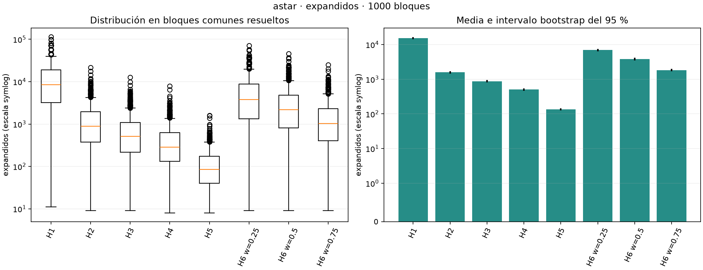
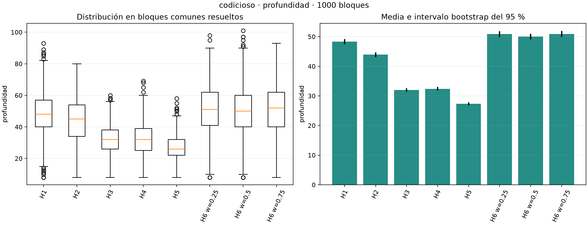
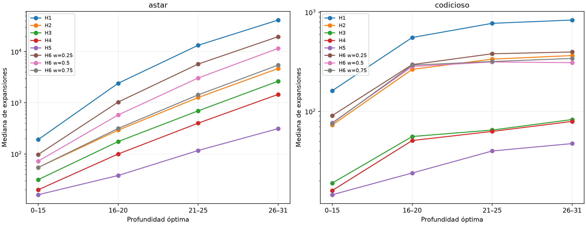
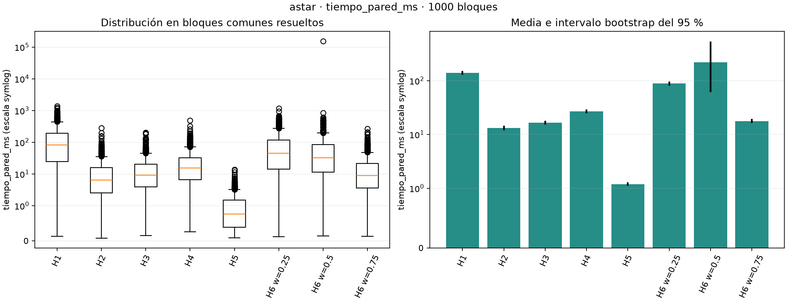
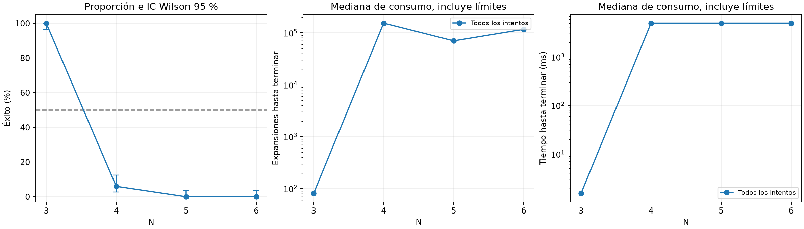
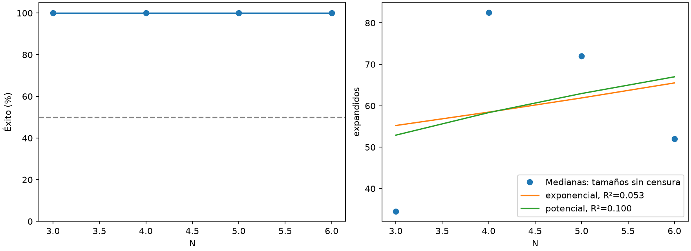
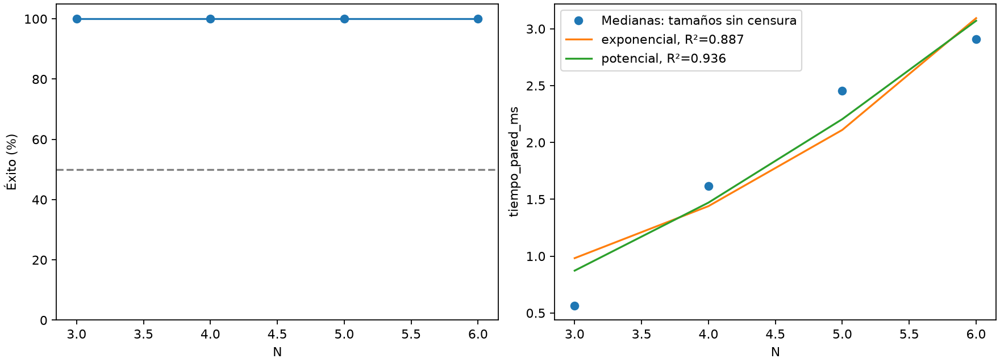

# Análisis complementarios e historial de la práctica

**Archivo separado en la Fase 8.** El documento principal para redactar el informe es [README.md](README.md). Este archivo conserva el análisis ampliado y el historial que no deben incorporarse automáticamente a la síntesis estadística pedida por el docente.

Aquí se archivan las secciones 6–14 de la versión anterior: diseño histórico; validación detallada; estado de fases; fuentes; comparación extensa de las 16 configuraciones; análisis por dificultad, H3/H4 y pesos de H6; sensibilidad de tiempos; tablas y modelos de escalabilidad, incluido el estudio complementario de mezcla corta; conclusiones amplias; auditorías y cierre. Al final se conserva una tabla resumen redundante retirada de la síntesis de H5.

**La numeración histórica se conserva intencionadamente.** Las referencias a secciones 6–14 remiten a este archivo; las secciones 1–5 siguen en el README principal. Las menciones a la antigua sección 15 corresponden ahora a la sección 6 del README principal. Los estados de fases, conteos de figuras y comprobaciones se refieren al momento de cada auditoría, no a una nueva evaluación realizada aquí.

Que un análisis quede archivado no lo vuelve incorrecto ni invalida los datos. Se mantienen los originales para trazabilidad y consulta. La comparación de heurísticas necesaria para justificar H5 sigue resumida en el documento principal, al igual que la comparación de algoritmos y el uso posterior de H5. No se afirma que la aclaración del docente elimine otros apartados de la guía.

---

## 6. Diseño experimental definido en la Fase 3

**Estos comandos documentan el diseño inicial; no se ejecutaron en la Fase 3. El protocolo definitivo y los resultados de la Fase 4 se documentan desde la sección 10.**

### 6.1. Experimento 1

Se usarán 1000 permutaciones distintas y solubles, muestreadas por rechazo con semilla 20260911. No se elimina la meta si aparece en el muestreo. Todas las configuraciones reciben los mismos estados. El orden de las 16 configuraciones y de las instancias se fija con la semilla independiente 20260912. No hay ejecuciones concurrentes de tratamientos.

```powershell
.venv\Scripts\python.exe experimentos.py preparar --n 3 --cantidad 1000 --semilla 20260911 --salida resultados/instancias_3.json
.venv\Scripts\python.exe experimentos.py ejecutar --instancias resultados/instancias_3.json --salida resultados/experimento1 --experimento 1 --segundos 300 --memoria-mb 1024 --nodos 2000000
```

Son `1000 × 2 × 8 = 16000` búsquedas. H6 utiliza tres pesos interiores para no duplicar H1 y H2. No se añaden repeticiones de tiempo sobre la misma instancia sin redefinir antes el protocolo.

Cada salida contiene `resultados.csv`, copia de `instancias.json` y `metadatos.json`: hardware, versión de Python, argumentos, orden, hashes SHA-256 de código e instancias y preparación de patrones. Los CSV se vacían al disco tras cada fila. `completo` solo pasa a verdadero al terminar todos los tratamientos. Se rechaza sobrescribir carpetas de resultados; un lote interrumpido queda identificado como parcial y no se completa con datos inventados. El programa no reanuda automáticamente un lote parcial.

### 6.2. Experimento 2

Se elegirá la heurística con mejor comportamiento bajo A*, considerando mediana de expansiones, mediana de tiempo, memoria y éxito. Se mostrarán también ganadoras por métrica; no se afirmará que existe una ganadora absoluta si los indicadores discrepan. Como regla de selección reproducible se propone priorizar tasa de éxito y luego mediana de expansiones, tiempo y memoria, en ese orden, documentando los compromisos.

Para cada N comenzando por 3 se generarán 100 instancias solubles por permutación, con semilla `20260911+N`. Si se usa una muestra menor por factibilidad, se fijará antes del lote y se informará el denominador real. El método de generación será el mismo en todos los tamaños. Una caminata corta no se presentará como equivalente a una permutación uniforme.

Ejemplo de sintaxis **solo si H4 fuese la seleccionada**, sin anticipar que lo será:

```powershell
.venv\Scripts\python.exe experimentos.py preparar --n 4 --cantidad 100 --semilla 20260915 --salida resultados/instancias_4.json
.venv\Scripts\python.exe experimentos.py ejecutar --instancias resultados/instancias_4.json --salida resultados/escalabilidad_4 --experimento 2 --heuristica H4 --segundos 300 --memoria-mb 1024 --nodos 2000000
```

La preparación tiene límite independiente de 300 segundos, configurable mediante `--segundos-preparacion`. Una preparación inviable aborta el lote y deja `completo=false`; no constituye una búsqueda fallida sobre 100 instancias que nunca llegaron a ejecutarse.

El límite práctico será el mayor N observado con al menos 50 % de instancias resueltas dentro de los presupuestos. También interviene el límite en nodos, que deberá acompañar tiempo y RAM al reportar ese límite. La guía propone cinco minutos y ocho GB como ejemplos; este proyecto ofrece valores configurables y un valor inicial conservador de un GiB. Los presupuestos definitivos se fijarán antes del experimento, sin ajustarlos por algoritmo después de mirar los resultados.

El rango `3,4,5,…` no autoriza una ejecución ilimitada: en la Fase 4 se documentará un rango finito y el criterio de parada según viabilidad. Si las permutaciones grandes no se resuelven, esa ausencia es parte del resultado; no se reemplazarán silenciosamente por casos más fáciles. El cambio de tamaño de los patrones también será una limitación explícita del estudio.

### 6.3. Plan estadístico histórico de la Fase 3

Para cada configuración: media, mediana, desviación estándar muestral, mínimo, máximo, P25 y P75 de las métricas cuantitativas. Se calcularán intervalos del 95 % para la media mediante bootstrap percentil con 5000 remuestreos de instancias y semilla 20260913. El éxito se expresará como proporción con su denominador e intervalo Wilson del 95 %, que evita intervalos artificialmente degenerados si todos los intentos tienen el mismo resultado.

Friedman se aplicará por algoritmo a las mismas instancias, con nodos expandidos como variable principal y nivel 0.05. Si resulta significativo se usarán contrastes Wilcoxon pareados y corrección Bonferroni sobre todos los pares de la familia. Se contemplarán empates y pares con diferencias todas nulas. Los tiempos y demás métricas se analizarán con sus familias de comparaciones identificadas, sin seleccionar solo contrastes favorables.

Un lote incompleto no se considerará un diseño completo de 1000 bloques. Si existen interrupciones, se reportarán por separado éxito y consumo hasta el límite; los contrastes sobre soluciones se restringirán a bloques comunes completos, indicando el número y el sesgo potencial. Una profundidad ausente no se codificará como cero. Un tiempo hasta la interrupción no será presentado como tiempo hasta la solución. La falta de suficientes bloques se informará, sin forzar la prueba.

Se generarán tablas descriptivas, boxplots, barras con intervalos, tablas de post-hoc y curvas de tiempo/nodos frente a N. Para crecimiento se ajustarán por regresión no lineal `a·b^N` y `a·N^c` sobre medianas de tamaños totalmente resueltos; se reportarán parámetros y R². Se requieren al menos cuatro tamaños distintos, valores positivos y variación. Esta regla evita ajustar a medianas seleccionadas solo entre casos fáciles resueltos cuando otros fueron censurados. Sin suficientes tamaños pertinentes se documentará la limitación; no se asignarán valores a casos censurados ni se ajustará una curva sobre dos puntos para aparentar evidencia.

El programa `analizar.py` ya está preparado. Rechaza lotes de validación, registros duplicados, bloques faltantes y lotes sin completar. La aproximación de Friedman requiere más de diez bloques y más de seis tratamientos; si no se cumplen, el programa declara insuficiencia. Los contrastes secundarios constituyen familias separadas; Bonferroni se aplica a los 28 pares dentro de cada familia, no como una corrección global de todas las métricas. Las tablas distinguen consumo de todos los intentos y valores de las soluciones; los gráficos comparativos y contrastes usan bloques comunes resueltos.

Comandos reservados para cuando existan los resultados formales:

```powershell
.venv\Scripts\python.exe analizar.py comparacion resultados/experimento1 --salida resultados/analisis1
.venv\Scripts\python.exe analizar.py escalabilidad resultados/escalabilidad_3 resultados/escalabilidad_4 --salida resultados/analisis_escalabilidad
```

El segundo comando puede recibir más carpetas de tamaños. Con solo dos tamaños dibujará los datos y declarará insuficiencia para ajustar; no fabricará un modelo. Se rechaza mezclar heurísticas o presupuestos diferentes en un mismo análisis de escalabilidad. La salida incluye JSON, CSV descriptivo en comparación, PNG y versiones de las bibliotecas. El JSON conserva hashes de los CSV de entrada. La interpretación de los resultados y su incorporación al informe se realizarán en la Fase 4.

## 7. Validación efectuada en la Fase 3

### 7.1. Pruebas funcionales

```powershell
.venv\Scripts\python.exe -m unittest discover -s pruebas -v
.venv\Scripts\python.exe validar_heuristicas.py
.venv\Scripts\python.exe juego.py --prueba-grafica --captura verificacion/juego.png
```

Las 14 pruebas funcionales cubren tableros inválidos, paridad par/impar, movimientos reversibles, reproducibilidad, estado meta, caso de un paso, instancia de profundidad 31, comparación de A* con un oráculo BFS independiente hasta profundidad 8, caminos legales de ambos algoritmos, H6 con tres pesos, límites y cancelación, presupuesto de patrones, generalización a N=4 y N=5, controles del juego y asistente en proceso separado. Cuatro pruebas adicionales de análisis utilizan datos artificiales únicamente como casos de prueba: medias conocidas, empates, corrección múltiple y una función exponencial conocida. Estos datos no se guardan como observaciones del puzzle. **La ejecución conjunta terminó con las 18 pruebas aprobadas**; se conserva el reporte en [verificacion/pruebas.txt](verificacion/pruebas.txt). La prueba gráfica usa SDL sin ventana; la imagen resultante se revisó visualmente.

En el entorno aislado de desarrollo, Windows bloqueó canales de comunicación de `multiprocessing`. Las pruebas de procesos se ejecutaron con el permiso de ejecución local correspondiente. También se corrigió un cierre prematuro del canal del ejecutor experimental. No se requiere cambiar la configuración del sistema para la ejecución normal desde una terminal local.

### 7.2. Validación exhaustiva de heurísticas

El programa de validación construye un oráculo mediante BFS inversa, exclusivamente para pruebas, y verifica cada función frente a la distancia exacta y cada transición. Sus resultados reales están en [verificacion/heuristicas.json](verificacion/heuristicas.json):

| Comprobación | Resultado observado |
|---|---|
| Estados solubles recorridos | 181440 |
| Transiciones dirigidas comprobadas por heurística | 483840 |
| Configuraciones verificadas | H1–H5 y H6 con 0.25, 0.50 y 0.75 |
| Admisibilidad | Sin violaciones |
| Consistencia | Sin violaciones |
| Dominancia H4 ≥ H3 ≥ H2 ≥ H1 | Sin violaciones |
| Estados en los que H4 > H3 | 90147 |

Ejemplo obtenido por el verificador:

```text
1 5 2
4 3 6
7 8 0
```

Distancia exacta: 6; H3: 4; H4: 6.

**Resultado de validación:** las propiedades se verificaron sobre todo el componente soluble de Puzzle-8. **Interpretación:** la corrección de esquinas tiene un aporte distinto de H3 y no viola las cotas en este dominio. **Conclusión permitida:** ambas formulaciones superan las comprobaciones exhaustivas de admisibilidad y consistencia para N=3. Esto no demuestra que H4 sea más rápida ni reemplaza los experimentos de la guía. Para N mayor se dispone de las demostraciones generales y pruebas funcionales, no de enumeración exhaustiva.

### 7.3. Prueba del registro experimental

Se utilizaron solamente dos instancias de mezcla corta, con `--validacion`, para recorrer las 16 configuraciones. Los 32 registros de [verificacion/integracion/resultados.csv](verificacion/integracion/resultados.csv) comprueban el circuito de ejecución, identificación y guardado. No son la muestra de 1000 instancias ni se usarán para seleccionar una ganadora.

Para repetir la prueba sin sobrescribir evidencia:

```powershell
.venv\Scripts\python.exe experimentos.py ejecutar --instancias verificacion/instancias_prueba.json --salida resultados/prueba_integracion --validacion --segundos 5
```

## 8. Estado histórico al cerrar la Fase 3

| Requisito | Estado al terminar Fase 3 |
|---|---|
| Puzzle generalizado, Codicioso y A* | Implementado y probado. |
| H1–H6 y tres pesos | Implementado; H3/H4 corregidas y justificadas. |
| Juego Pygame, tamaños y asistente | Implementado; controles, render y proceso verificados. |
| Generación, CSV, métricas y metadatos | Implementado; prueba de integración pequeña. |
| Diseño experimental y criterios estadísticos | Documentados para ejecución posterior. |
| Programa de análisis y gráficos | Implementado; no ejecutado sobre resultados formales. |
| Experimento de 16000 búsquedas | Pendiente de Fase 4. |
| Escalabilidad, N máximo y modelos | Pendientes de Fase 4. |
| Estadísticas, contrastes y gráficos de resultados | Pendientes de Fase 4. |
| Ganadoras, hallazgos experimentales y conclusiones | Pendientes de evidencia real. |
| Auditoría de entregables y rúbrica | Reservada a Fases 5 y 6. |
| Informe formal y presentación | Elaboración manual del estudiante. |

Al cerrar la Fase 3 todavía no había conclusiones estadísticas. El avance posterior se documenta desde la sección 10, con resultados, interpretación y conclusión separados.

## 9. Fuentes

- Material académico y guía originales en `material/`, especialmente §§1–4 y 7–9 de la guía. Su índice está desactualizado: se sigue la numeración del cuerpo.
- Korf y Felner, *Disjoint pattern database heuristics*, Artificial Intelligence 134 (2002), 9–22: https://doi.org/10.1016/S0004-3702(01)00092-3. Fundamento de la suma con reparto de costos.
- Documentación oficial de Pygame: https://www.pygame.org/docs/.
- Documentación oficial de SciPy: [Friedman](https://docs.scipy.org/doc/scipy/reference/generated/scipy.stats.friedmanchisquare.html), [Wilcoxon](https://docs.scipy.org/doc/scipy/reference/generated/scipy.stats.wilcoxon.html), [bootstrap](https://docs.scipy.org/doc/scipy/reference/generated/scipy.stats.bootstrap.html) y [regresión no lineal](https://docs.scipy.org/doc/scipy/reference/generated/scipy.optimize.curve_fit.html).

<!-- RESULTADOS_FASE4 -->

## 10. Fase 4: procedimiento y hallazgos del experimento principal

El 14 de septiembre de 2026 se ejecutaron **16000 búsquedas reales**: dos algoritmos y ocho configuraciones sobre las mismas 1000 permutaciones solubles distintas de Puzzle-8. Todas terminaron con solución. Las configuraciones de A* coincidieron en profundidad y sus **8000 respuestas se verificaron contra un oráculo BFS independiente**. Las profundidades óptimas de la muestra van de 8 a 30, con mediana 22 y media 21.855.

Los archivos originales están en [resultados/experimento1](resultados/experimento1), con instancias, mediciones, hashes y preparación. El análisis reproducible está en [analizar.py](analizar.py); las tablas y comprobaciones adicionales se generan con [documentar_resultados.py](documentar_resultados.py). La especificación previa de los experimentos se conserva en [protocolo_fase4.json](resultados/protocolo_fase4.json). Los resultados formales se incluyen en el proyecto; no se excluyen mediante `.gitignore`.

Se ejecutó un tratamiento a la vez, en un proceso nuevo por configuración. Se conservaron los límites de 300 segundos, 1024 MiB de RSS y dos millones de nodos simultáneos para el experimento principal. Ningún caso alcanzó esos límites. La máquina tiene un Intel Core i7-1165G7 de 11.ª generación, frecuencia nominal de 2.80 GHz, ocho procesadores lógicos, 16805126144 bytes de RAM, Windows 11 y Python 3.13.15 de 64 bits. El sistema no es un entorno de laboratorio con frecuencia, temperatura y actividad externa completamente controladas; hubo tareas breves de análisis y documentación durante parte de la ejecución. Se conservan CPU y tiempo de pared para hacer visible esa limitación.

### 10.1. Eficiencia de las heurísticas en A*

**Resultado.** H5 presenta una mediana de 85 expansiones; H4, 284.5; H3, 511; Manhattan, 895.5; y H1, 8461.5. H5 reduce aproximadamente un **90.5 %** la mediana respecto de Manhattan y un **99.0 %** respecto de H1. Son diferencias relativas entre medianas, no la mediana de porcentajes individuales. Su mediana de tiempo real es 0.76035 ms y su media de CPU es 1.140625 ms.

**Interpretación.** Las bases de patrones capturan restricciones conjuntas que Manhattan ignora. La reducción del trabajo de búsqueda compensa aquí el costo de consultar las tablas. Su preparación en A* requirió 49.759 ms para 30240 entradas; se registra fuera del tiempo de cada búsqueda. Amortizada entre 1000 casos representa aproximadamente 0.0498 ms adicionales por caso. No debe confundirse esta amortización con el costo de una única consulta que construya la tabla desde cero.

**Conclusión.** H5 fue seleccionada para el experimento de escalabilidad mediante el criterio definido: éxito y, a continuación, medianas de expansiones, CPU y memoria en nodos. Es la opción más favorable de esta implementación y muestra para reducir búsqueda, conservar optimalidad y obtener tiempos bajos; esto no prueba superioridad universal en otros tamaños o particiones.



### 10.2. Más información heurística no implica menos tiempo

**Resultado.** H4 reduce la mediana de expansiones de 511 a 284.5 frente a H3, aproximadamente un 44.3 %. Sin embargo, la media de CPU aumenta de 16.296875 a 26.21875 ms, aproximadamente un 60.9 %, y la mediana de tiempo real pasa de 9.06585 a 15.3148 ms.

**Interpretación.** H4 calcula H3 y además consulta las abstracciones de esquinas. El ahorro de nodos no compensa su mayor costo de evaluación por nodo en este experimento. El precálculo ya se excluyó de los tiempos de búsqueda, por lo que no explica por sí solo el aumento observado.

**Conclusión.** La corrección de H4 es válida y aporta información, pero no desplaza a H3 como opción más rápida en esta comparación. Este resultado ilustra el equilibrio entre precisión y trabajo por nodo discutido en las diapositivas.

### 10.3. Codicioso: velocidad frente a calidad de solución

**Resultado.** Con H5, Codicioso tiene medianas de 36 expansiones, 0.33715 ms de tiempo real y 26 movimientos. A* con H5 tiene 85 expansiones, 0.76035 ms y 22 movimientos. Codicioso obtiene el óptimo en **352 de 1000 casos (35.2 %)**; el exceso pareado mediano respecto al óptimo es de cuatro movimientos y el exceso máximo es 34. H1 solo obtiene soluciones óptimas en 24 casos (2.4 %).

**Interpretación.** Ignorar el costo acumulado permite a Codicioso concentrarse en estados atractivos según h, pero puede aceptar rutas más largas. La menor cantidad de expansiones no significa por sí misma una solución mejor. Las diferencias de CPU submilisegundo no se pueden interpretar directamente desde medianas iguales a cero.

**Conclusión.** Codicioso con H5 resulta útil si se prioriza una respuesta rápida y se toleran movimientos adicionales. A* con H5 es preferible cuando se exige costo mínimo. Ambos tuvieron 100 % de éxito en estas 1000 instancias, por lo que la tasa de éxito no los diferencia aquí. Ese 100 % es por configuración y no convierte las 16000 búsquedas en 16000 instancias independientes.



### 10.4. Memoria: nodos almacenados y RAM no son la misma medida

**Resultado.** H5 tiene la menor mediana de memoria en nodos: 152 para A* y 67.5 para Codicioso. El menor RSS mediano, en cambio, corresponde a H3: 28.539 MiB en A* y 24.816 MiB en Codicioso. H5 registra respectivamente 29.566 y 28.984 MiB.

**Interpretación.** El conteo de frontera más visitados no incluye las PDB, las tablas geométricas, todos los padres ni el intérprete. El resultado es compatible con el costo adicional de las bases de patrones. No se puede atribuir cada byte de la diferencia exclusivamente a ellas: RSS también depende del asignador y del estado del proceso.

**Conclusión.** H5 gana en memoria de búsqueda expresada en nodos, pero no en RSS mediano. El informe y la presentación deben indicar siempre qué definición de memoria utilizan. RSS es un máximo muestreado, no una medición continua ni una cuota dura del sistema.

### 10.5. Pesos de H6 y dificultad

**Resultado.** En A*, las medianas de expansiones para pesos 0.25, 0.50 y 0.75 son 3814, 2177 y 1037.5. Todas conservan las mismas profundidades óptimas. Manhattan expande menos, con mediana 895.5. En Codicioso, las medianas de profundidad de esas variantes son 51, 50 y 52, y sus tasas de optimalidad solo 2.7 %, 3.0 % y 3.1 %.

**Interpretación.** Acercar la combinación convexa a Manhattan mejora aquí la búsqueda de A*, pero no supera a Manhattan. Codicioso no hereda una mejora monótona de calidad por aumentar el peso. Las pruebas post-hoc de profundidad no detectan diferencias significativas entre los tres pesos tras la corrección.

**Conclusión.** H6 no introduce un intercambio entre rapidez y optimalidad de A*: todas sus variantes mantienen optimalidad. En este experimento tampoco aporta una alternativa competitiva a H5.

**Resultado por dificultad.** Los estratos de profundidad óptima 0–15, 16–20, 21–25 y 26–31 contienen 46, 281, 541 y 132 casos. Para A*–H1 las medianas de expansiones son 191, 2409, 13298 y 41403; para A*–H5 son 16, 38, 117 y 313.

**Interpretación.** El trabajo crece con la profundidad y la diferencia entre heurísticas se amplía. Los estratos se calculan después de muestrear, no se usaron para seleccionar casos favorables. La profundidad y el tamaño del tablero son factores distintos.

**Conclusión.** H5 mantiene una reducción muy marcada del espacio explorado incluso en el estrato más difícil de la muestra.



### 10.6. Significación estadística y sus límites

**Resultado.** Friedman sobre expansiones arroja χ²=6977.1304 para A* y χ²=5457.9976 para Codicioso, con siete grados de libertad y 1000 bloques. Los p numéricos subdesbordan a cero; se reportan como **p<1e-300**, no como probabilidades exactamente nulas. Los 28 pares de heurísticas resultan significativos en cada algoritmo después de Wilcoxon–Bonferroni.

En A*, todas las profundidades coinciden. La fórmula con corrección de empates queda degenerada; el programa la trata explícitamente como ausencia de diferencias observadas, con estadístico convencional 0 y p=1. No se ejecuta un post-hoc innecesario para esa variable.

**Interpretación.** La evidencia respalda diferencias sistemáticas de expansiones dentro de la muestra pareada. La significación no demuestra que todos los efectos sean grandes ni que una heurística sea mejor en todas las instancias. Los tamaños de efecto se muestran mediante diferencias pareadas y comparaciones relativas; los intervalos del 95 % describen incertidumbre de medias, no de cada ejecución.

Hay excepciones por otras métricas. A*–H3 y A*–H6 con w=0.75 no presentan diferencias temporales significativas tras Bonferroni (p ajustado=1 en CPU y pared). Las profundidades de Codicioso–H3 y H4 tampoco difieren significativamente (p ajustado=1). Esto significa falta de evidencia para esas diferencias, no prueba de equivalencia.

**Conclusión.** Las conclusiones deben formularse por métrica. La prueba principal es expansiones; generados, RSS y tiempo de pared se incluyen además como análisis exploratorios. La corrección abarca los 28 pares de cada familia, no todas las métricas simultáneamente. Wilcoxon supone simetría de las diferencias bajo la hipótesis nula; no debe describirse sin más como una prueba universal de igualdad de medianas.

### 10.7. Resolución temporal y observación extrema

**Resultado.** 927 de las 1000 búsquedas A*–H5 y 977 de Codicioso–H5 registran cero en CPU, mientras que sus tiempos reales son positivos. Las mediciones de CPU muestran cuantización de aproximadamente 15.625 ms.

Una ejecución, instancia 728 de A*–H6 con w=0.50, registra **154201.303 ms de pared y 187.5 ms de CPU**. La media de pared de ese tratamiento es 219.777 ms. Como comprobación de sensibilidad, al omitir únicamente ese punto sería 65.642 ms, y la mediana cambiaría de 32.456 a 32.283 ms. La observación **se conserva en los CSV, tablas, intervalos y contrastes oficiales**; el cálculo sin ella solo diagnostica sensibilidad.

**Interpretación.** El cero en CPU no representa una búsqueda instantánea. La diferencia extrema entre CPU y pared es compatible con una demora de planificación, suspensión u otra interferencia externa; los datos no identifican cuál. La media resulta mucho más sensible a esa observación que la mediana.

**Conclusión.** No se debe clasificar el rendimiento submilisegundo por medianas de CPU iguales a cero ni atribuir esa demora extrema únicamente a H6. Se presentan ambas medidas, estadísticas robustas y limitaciones, sin corregir manualmente resultados.



### 10.8. Tablas completas y trazabilidad

Las tablas siguientes proceden de las ejecuciones originales. Las medias e intervalos se calcularon sobre 1000 observaciones por combinación. Se usa desviación estándar muestral, percentiles lineales y bootstrap percentil del 95 % con 5000 remuestreos y semilla 20260913. Los intervalos de éxito emplean Wilson: para el 100 % observado en cada configuración, el IC95 es aproximadamente [99.62 %, 100 %]. Los boxplots muestran mediana, cuartiles, bigotes de 1.5 IQR y observaciones fuera de los bigotes; estas observaciones no se eliminaron. La escala `symlog` mantiene el cero y permite ver órdenes de magnitud; no debe interpretarse como una escala lineal. Profundidad y RSS se muestran en escala lineal.

Los CSV mantienen precisión completa. Las tablas Markdown redondean para lectura. Pueden regenerarse mediante:

```powershell
.venv\Scripts\python.exe analizar.py comparacion resultados/experimento1 --salida resultados/analisis1_repetido
.venv\Scripts\python.exe documentar_resultados.py
```

El segundo comando utiliza los resultados de `analisis1` y regenera solo sus tablas y comprobaciones auxiliares. No vuelve a ejecutar búsquedas ni modifica los CSV originales. Las descriptivas completas están en [descriptivas.csv](resultados/analisis1/descriptivas.csv), y los contrastes de las siete métricas y las diferencias entre algoritmos están en [analisis.json](resultados/analisis1/analisis.json).

Cada figura contiene un boxplot y barras de medias con IC95. Esta tabla permite consultar las catorce figuras:

| Métrica | A* | Codicioso |
|---|---|---|
| Profundidad | [Figura](resultados/analisis1/astar_profundidad.png) | [Figura](resultados/analisis1/codicioso_profundidad.png) |
| Expandidos | [Figura](resultados/analisis1/astar_expandidos.png) | [Figura](resultados/analisis1/codicioso_expandidos.png) |
| Generados | [Figura](resultados/analisis1/astar_generados.png) | [Figura](resultados/analisis1/codicioso_generados.png) |
| CPU | [Figura](resultados/analisis1/astar_tiempo_cpu_ms.png) | [Figura](resultados/analisis1/codicioso_tiempo_cpu_ms.png) |
| Tiempo de pared | [Figura](resultados/analisis1/astar_tiempo_pared_ms.png) | [Figura](resultados/analisis1/codicioso_tiempo_pared_ms.png) |
| Memoria en nodos | [Figura](resultados/analisis1/astar_memoria_max_nodos.png) | [Figura](resultados/analisis1/codicioso_memoria_max_nodos.png) |
| RSS muestreado | [Figura](resultados/analisis1/astar_rss_max_muestreado_mb.png) | [Figura](resultados/analisis1/codicioso_rss_max_muestreado_mb.png) |


### 10.9. Datos tabulados del experimento principal


| Algoritmo | Heurística | Éxitos/1000 | Pasos med. | Expandidos med. | Generados med. | CPU med. ms | Pared med. ms | Memoria med. nodos |
|---|---|---|---|---|---|---|---|---|
| astar | H1 | 1000 | 22 | 8462 | 2.3e+04 | 78.12 | 81.43 | 1.316e+04 |
| astar | H2 | 1000 | 22 | 895.5 | 2382 | 0 | 6.338 | 1415 |
| astar | H3 | 1000 | 22 | 511 | 1366 | 15.62 | 9.066 | 817 |
| astar | H4 | 1000 | 22 | 284.5 | 767.5 | 15.62 | 15.31 | 467 |
| astar | H5 | 1000 | 22 | 85 | 237.5 | 0 | 0.7603 | 152 |
| astar | H6 w=0.25 | 1000 | 22 | 3814 | 1.033e+04 | 46.88 | 45.4 | 6041 |
| astar | H6 w=0.5 | 1000 | 22 | 2177 | 5854 | 31.25 | 32.46 | 3444 |
| astar | H6 w=0.75 | 1000 | 22 | 1038 | 2780 | 15.62 | 8.961 | 1642 |
| codicioso | H1 | 1000 | 48 | 711.5 | 1939 | 0 | 4.278 | 1106 |
| codicioso | H2 | 1000 | 45 | 326 | 890.5 | 0 | 1.723 | 508.5 |
| codicioso | H3 | 1000 | 32 | 63 | 174 | 0 | 1.355 | 112 |
| codicioso | H4 | 1000 | 32 | 60 | 164.5 | 0 | 1.894 | 105.5 |
| codicioso | H5 | 1000 | 26 | 36 | 101 | 0 | 0.3372 | 67.5 |
| codicioso | H6 w=0.25 | 1000 | 51 | 358 | 973.5 | 0 | 2.664 | 577 |
| codicioso | H6 w=0.5 | 1000 | 50 | 302 | 826 | 0 | 2.269 | 491 |
| codicioso | H6 w=0.75 | 1000 | 52 | 312 | 855 | 0 | 2.809 | 511 |


### Calidad de las soluciones de Codicioso


Comparación pareada con A* en la misma instancia y heurística. La razón excluye profundidad óptima cero.


| Heurística | Pares | Óptimas | % óptimas | Exceso med. | Exceso medio | Exceso máx. | Razón mediana | Razón máxima |
|---|---|---|---|---|---|---|---|---|
| H1 | 1000 | 24 | 2.4 | 26 | 26.49 | 70 | 2.182 | 5.429 |
| H2 | 1000 | 50 | 5 | 22 | 22.06 | 60 | 2.04 | 4 |
| H3 | 1000 | 123 | 12.3 | 10 | 10.17 | 38 | 1.435 | 2.9 |
| H4 | 1000 | 168 | 16.8 | 10 | 10.55 | 46 | 1.417 | 3.429 |
| H5 | 1000 | 352 | 35.2 | 4 | 5.504 | 34 | 1.167 | 2.417 |
| H6 w=0.25 | 1000 | 27 | 2.7 | 28 | 29 | 70 | 2.28 | 5 |
| H6 w=0.5 | 1000 | 30 | 3 | 28 | 28.22 | 80 | 2.25 | 4.889 |
| H6 w=0.75 | 1000 | 31 | 3.1 | 30 | 29.07 | 68 | 2.304 | 4.778 |


### Dificultad y expansiones


Los estratos se definen por la profundidad óptima obtenida por A*. Todas sus configuraciones coincidieron.


| Algoritmo | Heurística | Profundidad óptima | Casos | Expandidos med. | Pared med. ms | Pasos med. |
|---|---|---|---|---|---|---|
| astar | H1 | 0–15 | 46 | 191 | 1.109 | 14 |
| astar | H1 | 16–20 | 281 | 2409 | 17.36 | 19 |
| astar | H1 | 21–25 | 541 | 1.33e+04 | 111.9 | 23 |
| astar | H1 | 26–31 | 132 | 4.14e+04 | 456.3 | 26 |
| astar | H2 | 0–15 | 46 | 54.5 | 0.3448 | 14 |
| astar | H2 | 16–20 | 281 | 293 | 1.954 | 19 |
| astar | H2 | 21–25 | 541 | 1269 | 8.783 | 23 |
| astar | H2 | 26–31 | 132 | 4676 | 37.78 | 26 |
| astar | H3 | 0–15 | 46 | 31.5 | 0.8647 | 14 |
| astar | H3 | 16–20 | 281 | 175 | 3.054 | 19 |
| astar | H3 | 21–25 | 541 | 696 | 11.69 | 23 |
| astar | H3 | 26–31 | 132 | 2643 | 46.83 | 26 |
| astar | H4 | 0–15 | 46 | 20 | 1.424 | 14 |
| astar | H4 | 16–20 | 281 | 100 | 5.368 | 19 |
| astar | H4 | 21–25 | 541 | 400 | 20.57 | 23 |
| astar | H4 | 26–31 | 132 | 1460 | 76.18 | 26 |
| astar | H5 | 0–15 | 46 | 16 | 0.1757 | 14 |
| astar | H5 | 16–20 | 281 | 38 | 0.3528 | 19 |
| astar | H5 | 21–25 | 541 | 117 | 0.9713 | 23 |
| astar | H5 | 26–31 | 132 | 313 | 2.709 | 26 |
| astar | H6 w=0.25 | 0–15 | 46 | 97.5 | 0.9222 | 14 |
| astar | H6 w=0.25 | 16–20 | 281 | 1034 | 10.15 | 19 |
| astar | H6 w=0.25 | 21–25 | 541 | 5709 | 63.18 | 23 |
| astar | H6 w=0.25 | 26–31 | 132 | 1.959e+04 | 283.7 | 26 |
| astar | H6 w=0.5 | 0–15 | 46 | 72.5 | 1.192 | 14 |
| astar | H6 w=0.5 | 16–20 | 281 | 579 | 8.38 | 19 |
| astar | H6 w=0.5 | 21–25 | 541 | 3053 | 44.61 | 23 |
| astar | H6 w=0.5 | 26–31 | 132 | 1.155e+04 | 185.1 | 26 |
| astar | H6 w=0.75 | 0–15 | 46 | 54.5 | 0.4191 | 14 |
| astar | H6 w=0.75 | 16–20 | 281 | 316 | 2.738 | 19 |
| astar | H6 w=0.75 | 21–25 | 541 | 1428 | 12.69 | 23 |
| astar | H6 w=0.75 | 26–31 | 132 | 5443 | 51.78 | 26 |
| codicioso | H1 | 0–15 | 46 | 162 | 1.21 | 25 |
| codicioso | H1 | 16–20 | 281 | 557 | 3.473 | 43 |
| codicioso | H1 | 21–25 | 541 | 774 | 4.714 | 50 |
| codicioso | H1 | 26–31 | 132 | 835 | 4.871 | 54 |
| codicioso | H2 | 0–15 | 46 | 73 | 0.4027 | 19 |
| codicioso | H2 | 16–20 | 281 | 266 | 1.489 | 38 |
| codicioso | H2 | 21–25 | 541 | 337 | 1.772 | 47 |
| codicioso | H2 | 26–31 | 132 | 366.5 | 1.964 | 55.5 |
| codicioso | H3 | 0–15 | 46 | 19 | 0.4746 | 15 |
| codicioso | H3 | 16–20 | 281 | 56 | 1.175 | 28 |
| codicioso | H3 | 21–25 | 541 | 65 | 1.429 | 33 |
| codicioso | H3 | 26–31 | 132 | 83 | 1.819 | 39.5 |
| codicioso | H4 | 0–15 | 46 | 16 | 0.6044 | 14 |
| codicioso | H4 | 16–20 | 281 | 51 | 1.53 | 26 |
| codicioso | H4 | 21–25 | 541 | 63 | 2.052 | 33 |
| codicioso | H4 | 26–31 | 132 | 79.5 | 2.488 | 40 |
| codicioso | H5 | 0–15 | 46 | 14.5 | 0.1451 | 14 |
| codicioso | H5 | 16–20 | 281 | 24 | 0.2413 | 20 |
| codicioso | H5 | 21–25 | 541 | 40 | 0.3728 | 27 |
| codicioso | H5 | 26–31 | 132 | 47.5 | 0.4382 | 32 |
| codicioso | H6 w=0.25 | 0–15 | 46 | 91 | 0.8003 | 24 |
| codicioso | H6 w=0.25 | 16–20 | 281 | 297 | 2.161 | 44 |
| codicioso | H6 w=0.25 | 21–25 | 541 | 382 | 2.919 | 53 |
| codicioso | H6 w=0.25 | 26–31 | 132 | 398 | 2.881 | 58 |
| codicioso | H6 w=0.5 | 0–15 | 46 | 77 | 0.787 | 24 |
| codicioso | H6 w=0.5 | 16–20 | 281 | 284 | 2.09 | 44 |
| codicioso | H6 w=0.5 | 21–25 | 541 | 316 | 2.361 | 52 |
| codicioso | H6 w=0.5 | 26–31 | 132 | 310.5 | 2.417 | 58.5 |
| codicioso | H6 w=0.75 | 0–15 | 46 | 76 | 1.015 | 24 |
| codicioso | H6 w=0.75 | 16–20 | 281 | 293 | 2.562 | 44 |
| codicioso | H6 w=0.75 | 21–25 | 541 | 319 | 2.898 | 54 |
| codicioso | H6 w=0.75 | 26–31 | 132 | 342.5 | 3.36 | 62 |


### Contrastes globales y post-hoc


| Algoritmo | Métrica | Bloques | χ² Friedman | p | Pares significativos/28 |
|---|---|---|---|---|---|
| astar | profundidad | 1000 | 0 | 1 | no procede |
| astar | expandidos | 1000 | 6977 | <1e-300 (subdesbordamiento) | 28 |
| astar | generados | 1000 | 6977 | <1e-300 (subdesbordamiento) | 28 |
| astar | tiempo_cpu_ms | 1000 | 4424 | <1e-300 (subdesbordamiento) | 27 |
| astar | tiempo_pared_ms | 1000 | 5828 | <1e-300 (subdesbordamiento) | 27 |
| astar | memoria_max_nodos | 1000 | 6968 | <1e-300 (subdesbordamiento) | 28 |
| astar | rss_max_muestreado_mb | 1000 | 6807 | <1e-300 (subdesbordamiento) | 28 |
| codicioso | profundidad | 1000 | 3517 | <1e-300 (subdesbordamiento) | 24 |
| codicioso | expandidos | 1000 | 5458 | <1e-300 (subdesbordamiento) | 28 |
| codicioso | generados | 1000 | 5440 | <1e-300 (subdesbordamiento) | 28 |
| codicioso | tiempo_cpu_ms | 1000 | 443.3 | 1.229e-91 | 19 |
| codicioso | tiempo_pared_ms | 1000 | 3268 | <1e-300 (subdesbordamiento) | 26 |
| codicioso | memoria_max_nodos | 1000 | 5416 | <1e-300 (subdesbordamiento) | 28 |
| codicioso | rss_max_muestreado_mb | 1000 | 6851 | <1e-300 (subdesbordamiento) | 28 |


Los p registrados como cero por precisión numérica no son probabilidades exactamente nulas. Bonferroni corrige 28 pares por familia; los intervalos del 95 % son individuales, no simultáneos.


#### astar: post-hoc de expansiones


| Par A | Par B | p ajustado | Significativo | Mediana A−B |
|---|---|---|---|---|
| H1 | H2 | 9.312e-164 | sí | 7146 |
| H1 | H3 | 9.312e-164 | sí | 7663 |
| H1 | H4 | 9.312e-164 | sí | 7956 |
| H1 | H5 | 9.312e-164 | sí | 8378 |
| H1 | H6 w=0.25 | 9.311e-164 | sí | 4619 |
| H1 | H6 w=0.5 | 9.312e-164 | sí | 6084 |
| H1 | H6 w=0.75 | 9.312e-164 | sí | 7092 |
| H2 | H3 | 1.027e-163 | sí | 396 |
| H2 | H4 | 9.522e-164 | sí | 615 |
| H2 | H5 | 9.353e-164 | sí | 805 |
| H2 | H6 w=0.25 | 9.452e-164 | sí | -2568 |
| H2 | H6 w=0.5 | 9.609e-164 | sí | -1143 |
| H2 | H6 w=0.75 | 1.282e-161 | sí | -97 |
| H3 | H4 | 9.517e-164 | sí | 215 |
| H3 | H5 | 9.351e-164 | sí | 412.5 |
| H3 | H6 w=0.25 | 9.453e-164 | sí | -3120 |
| H3 | H6 w=0.5 | 9.523e-164 | sí | -1670 |
| H3 | H6 w=0.75 | 9.958e-164 | sí | -540.5 |
| H4 | H5 | 1.522e-163 | sí | 194 |
| H4 | H6 w=0.25 | 9.326e-164 | sí | -3396 |
| H4 | H6 w=0.5 | 9.326e-164 | sí | -1874 |
| H4 | H6 w=0.75 | 9.451e-164 | sí | -735 |
| H5 | H6 w=0.25 | 9.326e-164 | sí | -3728 |
| H5 | H6 w=0.5 | 9.326e-164 | sí | -2074 |
| H5 | H6 w=0.75 | 9.325e-164 | sí | -946 |
| H6 w=0.25 | H6 w=0.5 | 9.451e-164 | sí | 1490 |
| H6 w=0.25 | H6 w=0.75 | 9.453e-164 | sí | 2520 |
| H6 w=0.5 | H6 w=0.75 | 9.609e-164 | sí | 1056 |


#### codicioso: post-hoc de expansiones


| Par A | Par B | p ajustado | Significativo | Mediana A−B |
|---|---|---|---|---|
| H1 | H2 | 1.55e-123 | sí | 398 |
| H1 | H3 | 1.026e-163 | sí | 635 |
| H1 | H4 | 1.028e-163 | sí | 638 |
| H1 | H5 | 9.667e-164 | sí | 668 |
| H1 | H6 w=0.25 | 7.828e-139 | sí | 337.5 |
| H1 | H6 w=0.5 | 1.754e-144 | sí | 400.5 |
| H1 | H6 w=0.75 | 1.336e-142 | sí | 411 |
| H2 | H3 | 4.388e-161 | sí | 242 |
| H2 | H4 | 3.75e-161 | sí | 245 |
| H2 | H5 | 3.073e-162 | sí | 276.5 |
| H2 | H6 w=0.25 | 0.0004107 | sí | -28 |
| H2 | H6 w=0.5 | 4.024e-07 | sí | 16 |
| H2 | H6 w=0.75 | 4.557e-09 | sí | 16 |
| H3 | H4 | 2.141e-06 | sí | 6 |
| H3 | H5 | 1.088e-84 | sí | 23 |
| H3 | H6 w=0.25 | 1.074e-162 | sí | -280 |
| H3 | H6 w=0.5 | 2.25e-162 | sí | -215.5 |
| H3 | H6 w=0.75 | 3.585e-162 | sí | -229 |
| H4 | H5 | 3.93e-60 | sí | 15 |
| H4 | H6 w=0.25 | 5.761e-163 | sí | -283.5 |
| H4 | H6 w=0.5 | 1.595e-162 | sí | -228 |
| H4 | H6 w=0.75 | 2.152e-161 | sí | -237 |
| H5 | H6 w=0.25 | 1.774e-163 | sí | -305.5 |
| H5 | H6 w=0.5 | 3.555e-163 | sí | -255.5 |
| H5 | H6 w=0.75 | 3.911e-163 | sí | -268 |
| H6 w=0.25 | H6 w=0.5 | 2.352e-69 | sí | 33 |
| H6 w=0.25 | H6 w=0.75 | 4.684e-49 | sí | 45 |
| H6 w=0.5 | H6 w=0.75 | 5.265e-20 | sí | 3 |


### Descriptivas completas: expandidos


| Algoritmo | Heurística | Media | DE | Mín. | P25 | Mediana | P75 | Máx. | IC95 inf. | IC95 sup. |
|---|---|---|---|---|---|---|---|---|---|---|
| astar | H1 | 1.533e+04 | 1.702e+04 | 11 | 3184 | 8462 | 1.892e+04 | 1.151e+05 | 1.428e+04 | 1.641e+04 |
| astar | H2 | 1575 | 1974 | 9 | 375 | 895.5 | 1941 | 2.151e+04 | 1457 | 1702 |
| astar | H3 | 876.7 | 1099 | 9 | 215.8 | 511 | 1082 | 1.277e+04 | 810.5 | 946.5 |
| astar | H4 | 504.7 | 646.9 | 8 | 132 | 284.5 | 625.2 | 7949 | 466 | 546.1 |
| astar | H5 | 134.6 | 150.5 | 8 | 40 | 85 | 175.2 | 1597 | 125.5 | 144.3 |
| astar | H6 w=0.25 | 6928 | 8528 | 9 | 1340 | 3814 | 8744 | 7.13e+04 | 6404 | 7469 |
| astar | H6 w=0.5 | 3834 | 4830 | 9 | 809.5 | 2177 | 4791 | 4.615e+04 | 3540 | 4140 |
| astar | H6 w=0.75 | 1839 | 2346 | 9 | 407.5 | 1038 | 2301 | 2.504e+04 | 1698 | 1987 |
| codicioso | H1 | 813.5 | 557 | 10 | 387.8 | 711.5 | 1064 | 3163 | 780.1 | 848.3 |
| codicioso | H2 | 309.6 | 193.2 | 8 | 128.8 | 326 | 399.5 | 810 | 297.4 | 321.2 |
| codicioso | H3 | 69.31 | 32.59 | 8 | 46 | 63 | 87 | 196 | 67.31 | 71.29 |
| codicioso | H4 | 64.08 | 33.85 | 8 | 36 | 60 | 85.25 | 189 | 62.02 | 66.28 |
| codicioso | H5 | 42.32 | 23.27 | 8 | 25 | 36 | 53 | 132 | 40.87 | 43.76 |
| codicioso | H6 w=0.25 | 331.7 | 166 | 8 | 180 | 358 | 452 | 731 | 321.6 | 342.3 |
| codicioso | H6 w=0.5 | 273.2 | 130.9 | 8 | 152.8 | 302 | 376.2 | 559 | 265.1 | 281.3 |
| codicioso | H6 w=0.75 | 271.2 | 126.1 | 8 | 143 | 312 | 373.2 | 513 | 263.4 | 278.9 |


### Descriptivas completas: generados


| Algoritmo | Heurística | Media | DE | Mín. | P25 | Mediana | P75 | Máx. | IC95 inf. | IC95 sup. |
|---|---|---|---|---|---|---|---|---|---|---|
| astar | H1 | 4.138e+04 | 4.579e+04 | 33 | 8642 | 2.3e+04 | 5.121e+04 | 3.085e+05 | 3.857e+04 | 4.429e+04 |
| astar | H2 | 4196 | 5248 | 25 | 1005 | 2382 | 5183 | 5.726e+04 | 3880 | 4532 |
| astar | H3 | 2337 | 2924 | 25 | 580 | 1366 | 2880 | 3.404e+04 | 2161 | 2523 |
| astar | H4 | 1365 | 1745 | 22 | 359 | 767.5 | 1691 | 2.142e+04 | 1261 | 1477 |
| astar | H5 | 375.5 | 417.3 | 22 | 114.8 | 237.5 | 492 | 4465 | 350.3 | 402.7 |
| astar | H6 w=0.25 | 1.867e+04 | 2.293e+04 | 25 | 3633 | 1.033e+04 | 2.358e+04 | 1.913e+05 | 1.726e+04 | 2.013e+04 |
| astar | H6 w=0.5 | 1.028e+04 | 1.292e+04 | 25 | 2176 | 5854 | 1.285e+04 | 1.234e+05 | 9493 | 1.11e+04 |
| astar | H6 w=0.75 | 4914 | 6262 | 25 | 1092 | 2780 | 6156 | 6.696e+04 | 4538 | 5310 |
| codicioso | H1 | 2215 | 1512 | 29 | 1062 | 1939 | 2898 | 8593 | 2124 | 2309 |
| codicioso | H2 | 852.1 | 534.5 | 22 | 349.8 | 890.5 | 1104 | 2235 | 818.4 | 884.4 |
| codicioso | H3 | 189.9 | 87.51 | 22 | 128 | 174 | 239 | 529 | 184.5 | 195.2 |
| codicioso | H4 | 176.3 | 91.35 | 22 | 101 | 164.5 | 234 | 522 | 170.8 | 182.2 |
| codicioso | H5 | 118.4 | 62.9 | 22 | 71 | 101 | 149 | 365 | 114.5 | 122.3 |
| codicioso | H6 w=0.25 | 905.6 | 453.4 | 22 | 488.8 | 973.5 | 1228 | 1983 | 877.9 | 934.6 |
| codicioso | H6 w=0.5 | 747.7 | 358.6 | 22 | 418.5 | 826 | 1033 | 1537 | 725.4 | 769.6 |
| codicioso | H6 w=0.75 | 742.5 | 345.1 | 22 | 389.8 | 855 | 1025 | 1408 | 721 | 763.6 |


### Descriptivas completas: tiempo_cpu_ms


| Algoritmo | Heurística | Media | DE | Mín. | P25 | Mediana | P75 | Máx. | IC95 inf. | IC95 sup. |
|---|---|---|---|---|---|---|---|---|---|---|
| astar | H1 | 135 | 174.1 | 0 | 15.62 | 78.12 | 187.5 | 1359 | 124.2 | 146 |
| astar | H2 | 12.67 | 20.68 | 0 | 0 | 0 | 15.62 | 281.2 | 11.45 | 13.97 |
| astar | H3 | 16.3 | 23.41 | 0 | 0 | 15.62 | 15.62 | 218.8 | 14.92 | 17.78 |
| astar | H4 | 26.22 | 35.83 | 0 | 0 | 15.62 | 31.25 | 468.8 | 24.08 | 28.52 |
| astar | H5 | 1.141 | 4.067 | 0 | 0 | 0 | 0 | 15.62 | 0.8906 | 1.406 |
| astar | H6 w=0.25 | 86.38 | 116.6 | 0 | 15.62 | 46.88 | 109.4 | 1125 | 79.33 | 93.72 |
| astar | H6 w=0.5 | 63.7 | 89.49 | 0 | 15.62 | 31.25 | 78.12 | 765.6 | 58.23 | 69.28 |
| astar | H6 w=0.75 | 17.47 | 25.37 | 0 | 0 | 15.62 | 15.62 | 250 | 15.94 | 19.08 |
| codicioso | H1 | 5.328 | 7.733 | 0 | 0 | 0 | 15.62 | 31.25 | 4.859 | 5.797 |
| codicioso | H2 | 1.734 | 4.911 | 0 | 0 | 0 | 0 | 15.62 | 1.438 | 2.062 |
| codicioso | H3 | 1.656 | 4.812 | 0 | 0 | 0 | 0 | 15.62 | 1.375 | 1.969 |
| codicioso | H4 | 2.234 | 5.473 | 0 | 0 | 0 | 0 | 15.62 | 1.906 | 2.578 |
| codicioso | H5 | 0.3594 | 2.343 | 0 | 0 | 0 | 0 | 15.62 | 0.2188 | 0.5156 |
| codicioso | H6 w=0.25 | 2.875 | 6.057 | 0 | 0 | 0 | 0 | 15.62 | 2.5 | 3.266 |
| codicioso | H6 w=0.5 | 2.234 | 5.473 | 0 | 0 | 0 | 0 | 15.62 | 1.906 | 2.578 |
| codicioso | H6 w=0.75 | 3.531 | 6.538 | 0 | 0 | 0 | 0 | 15.62 | 3.125 | 3.953 |


### Descriptivas completas: tiempo_pared_ms


| Algoritmo | Heurística | Media | DE | Mín. | P25 | Mediana | P75 | Máx. | IC95 inf. | IC95 sup. |
|---|---|---|---|---|---|---|---|---|---|---|
| astar | H1 | 139.1 | 177.9 | 0.1249 | 24.39 | 81.43 | 189.9 | 1381 | 128 | 150.4 |
| astar | H2 | 13.21 | 20.28 | 0.0781 | 2.501 | 6.338 | 15.82 | 282.7 | 12.01 | 14.5 |
| astar | H3 | 16.62 | 22.59 | 0.1554 | 3.872 | 9.066 | 20.37 | 204.7 | 15.28 | 18.08 |
| astar | H4 | 27.01 | 36.18 | 0.2548 | 6.514 | 15.31 | 32.37 | 490.6 | 24.85 | 29.32 |
| astar | H5 | 1.193 | 1.316 | 0.0828 | 0.3837 | 0.7603 | 1.518 | 13.75 | 1.116 | 1.277 |
| astar | H6 w=0.25 | 88.57 | 119.6 | 0.1208 | 14.27 | 45.4 | 117.5 | 1159 | 81.39 | 96.09 |
| astar | H6 w=0.5 | 219.8 | 4875 | 0.1438 | 11.26 | 32.46 | 84.87 | 1.542e+05 | 61.66 | 531.7 |
| astar | H6 w=0.75 | 17.72 | 25.18 | 0.1292 | 3.554 | 8.961 | 21.4 | 269.5 | 16.19 | 19.34 |
| codicioso | H1 | 5.392 | 4.239 | 0.0916 | 2.427 | 4.278 | 7.239 | 36.04 | 5.133 | 5.663 |
| codicioso | H2 | 1.813 | 1.238 | 0.0737 | 0.7093 | 1.723 | 2.56 | 10.06 | 1.735 | 1.89 |
| codicioso | H3 | 1.657 | 1.1 | 0.1655 | 0.8907 | 1.355 | 2.111 | 7.278 | 1.592 | 1.725 |
| codicioso | H4 | 2.297 | 1.542 | 0.2074 | 1.216 | 1.894 | 3.033 | 11.29 | 2.205 | 2.394 |
| codicioso | H5 | 0.3954 | 0.2293 | 0.0997 | 0.2395 | 0.3372 | 0.4792 | 2.04 | 0.3813 | 0.4099 |
| codicioso | H6 w=0.25 | 2.811 | 1.882 | 0.0855 | 1.438 | 2.664 | 3.671 | 23.26 | 2.698 | 2.931 |
| codicioso | H6 w=0.5 | 2.348 | 1.826 | 0.1067 | 1.265 | 2.269 | 3.056 | 41.1 | 2.241 | 2.471 |
| codicioso | H6 w=0.75 | 3.605 | 2.623 | 0.1077 | 1.822 | 2.809 | 5.035 | 33.41 | 3.446 | 3.771 |


### Descriptivas completas: memoria_max_nodos


| Algoritmo | Heurística | Media | DE | Mín. | P25 | Mediana | P75 | Máx. | IC95 inf. | IC95 sup. |
|---|---|---|---|---|---|---|---|---|---|---|
| astar | H1 | 2.208e+04 | 2.272e+04 | 24 | 5080 | 1.316e+04 | 2.822e+04 | 1.372e+05 | 2.068e+04 | 2.352e+04 |
| astar | H2 | 2436 | 2955 | 18 | 599 | 1415 | 3032 | 3.094e+04 | 2258 | 2624 |
| astar | H3 | 1378 | 1684 | 18 | 354.8 | 817 | 1701 | 1.915e+04 | 1277 | 1485 |
| astar | H4 | 818.8 | 1024 | 16 | 221.8 | 467 | 1014 | 1.235e+04 | 757.5 | 883.9 |
| astar | H5 | 235.1 | 254.1 | 16 | 75 | 152 | 306.2 | 2688 | 219.8 | 251.6 |
| astar | H6 w=0.25 | 1.041e+04 | 1.213e+04 | 18 | 2155 | 6041 | 1.343e+04 | 9.278e+04 | 9663 | 1.118e+04 |
| astar | H6 w=0.5 | 5838 | 7038 | 18 | 1287 | 3444 | 7430 | 6.271e+04 | 5409 | 6284 |
| astar | H6 w=0.75 | 2833 | 3496 | 18 | 648 | 1642 | 3586 | 3.57e+04 | 2622 | 3055 |
| codicioso | H1 | 1229 | 770.8 | 21 | 616.8 | 1106 | 1647 | 3695 | 1181 | 1277 |
| codicioso | H2 | 488.9 | 288 | 16 | 214 | 508.5 | 642 | 1194 | 470.8 | 506.4 |
| codicioso | H3 | 121.2 | 53.06 | 16 | 83 | 112 | 153 | 320 | 117.9 | 124.4 |
| codicioso | H4 | 113.1 | 56.12 | 16 | 67 | 105.5 | 149 | 331 | 109.7 | 116.7 |
| codicioso | H5 | 77.62 | 38.68 | 16 | 48 | 67.5 | 98 | 225 | 75.22 | 80.01 |
| codicioso | H6 w=0.25 | 535.1 | 264.8 | 16 | 291 | 577 | 725.2 | 1180 | 519 | 551.8 |
| codicioso | H6 w=0.5 | 449 | 212.8 | 16 | 255.8 | 491 | 625.2 | 926 | 435.9 | 462 |
| codicioso | H6 w=0.75 | 446.2 | 204.9 | 16 | 241 | 511 | 619 | 837 | 433.3 | 458.8 |


### Descriptivas completas: rss_max_muestreado_mb


| Algoritmo | Heurística | Media | DE | Mín. | P25 | Mediana | P75 | Máx. | IC95 inf. | IC95 sup. |
|---|---|---|---|---|---|---|---|---|---|---|
| astar | H1 | 42.91 | 3.128 | 25.62 | 40.8 | 42.83 | 44.58 | 56.61 | 42.71 | 43.1 |
| astar | H2 | 30.32 | 1.195 | 24.71 | 30.09 | 30.79 | 31.12 | 34 | 30.24 | 30.39 |
| astar | H3 | 28.22 | 0.8062 | 24.7 | 27.98 | 28.54 | 28.88 | 30.24 | 28.17 | 28.27 |
| astar | H4 | 28.67 | 0.5918 | 25.7 | 28.65 | 28.75 | 29.08 | 30.45 | 28.64 | 28.71 |
| astar | H5 | 29.45 | 0.2018 | 28.82 | 29.21 | 29.57 | 29.58 | 29.6 | 29.44 | 29.46 |
| astar | H6 w=0.25 | 37.74 | 2.47 | 25.02 | 36.26 | 37.11 | 38.82 | 49.52 | 37.59 | 37.89 |
| astar | H6 w=0.5 | 33.99 | 2.001 | 24.79 | 32.8 | 33.94 | 35 | 41.96 | 33.86 | 34.11 |
| astar | H6 w=0.75 | 31.4 | 1.484 | 24.68 | 30.91 | 32.1 | 32.44 | 35.15 | 31.31 | 31.49 |
| codicioso | H1 | 25.97 | 0.1961 | 24.81 | 25.88 | 25.96 | 26.08 | 26.36 | 25.95 | 25.98 |
| codicioso | H2 | 25.22 | 0.04325 | 24.9 | 25.19 | 25.22 | 25.26 | 25.29 | 25.22 | 25.22 |
| codicioso | H3 | 24.83 | 0.05743 | 24.68 | 24.78 | 24.82 | 24.9 | 24.9 | 24.83 | 24.83 |
| codicioso | H4 | 25.93 | 0.04575 | 25.65 | 25.91 | 25.91 | 25.97 | 25.97 | 25.93 | 25.93 |
| codicioso | H5 | 28.99 | 0.04394 | 28.71 | 28.95 | 28.98 | 29.02 | 29.06 | 28.98 | 28.99 |
| codicioso | H6 w=0.25 | 25.08 | 0.05125 | 24.77 | 25.04 | 25.09 | 25.12 | 25.16 | 25.08 | 25.08 |
| codicioso | H6 w=0.5 | 25.08 | 0.06597 | 24.79 | 25.02 | 25.07 | 25.16 | 25.16 | 25.07 | 25.08 |
| codicioso | H6 w=0.75 | 24.89 | 0.05598 | 24.67 | 24.84 | 24.88 | 24.96 | 24.96 | 24.89 | 24.9 |


### Descriptivas completas: profundidad


| Algoritmo | Heurística | Media | DE | Mín. | P25 | Mediana | P75 | Máx. | IC95 inf. | IC95 sup. |
|---|---|---|---|---|---|---|---|---|---|---|
| astar | H1 | 21.86 | 3.449 | 8 | 20 | 22 | 24 | 30 | 21.64 | 22.07 |
| astar | H2 | 21.86 | 3.449 | 8 | 20 | 22 | 24 | 30 | 21.64 | 22.07 |
| astar | H3 | 21.86 | 3.449 | 8 | 20 | 22 | 24 | 30 | 21.64 | 22.07 |
| astar | H4 | 21.86 | 3.449 | 8 | 20 | 22 | 24 | 30 | 21.64 | 22.07 |
| astar | H5 | 21.86 | 3.449 | 8 | 20 | 22 | 24 | 30 | 21.64 | 22.07 |
| astar | H6 w=0.25 | 21.86 | 3.449 | 8 | 20 | 22 | 24 | 30 | 21.64 | 22.07 |
| astar | H6 w=0.5 | 21.86 | 3.449 | 8 | 20 | 22 | 24 | 30 | 21.64 | 22.07 |
| astar | H6 w=0.75 | 21.86 | 3.449 | 8 | 20 | 22 | 24 | 30 | 21.64 | 22.07 |
| codicioso | H1 | 48.34 | 13.75 | 8 | 40 | 48 | 57 | 93 | 47.5 | 49.18 |
| codicioso | H2 | 43.92 | 13.41 | 8 | 34 | 45 | 54 | 80 | 43.06 | 44.75 |
| codicioso | H3 | 32.03 | 9.067 | 8 | 26 | 32 | 38 | 60 | 31.46 | 32.59 |
| codicioso | H4 | 32.41 | 10.15 | 8 | 25 | 32 | 39 | 69 | 31.8 | 33.04 |
| codicioso | H5 | 27.36 | 7.848 | 8 | 22 | 26 | 32 | 58 | 26.87 | 27.85 |
| codicioso | H6 w=0.25 | 50.85 | 15.74 | 8 | 41 | 51 | 62 | 98 | 49.85 | 51.84 |
| codicioso | H6 w=0.5 | 50.07 | 15.64 | 8 | 40 | 50 | 60 | 101 | 49.09 | 51.04 |
| codicioso | H6 w=0.75 | 50.92 | 16.14 | 8 | 40 | 52 | 62 | 93 | 49.92 | 51.94 |

## 11. Escalabilidad

### 11.1. Protocolo definitivo y alcance

Se fijaron cuatro tamaños, N=3, 4, 5 y 6, con 100 instancias distintas y solubles por tamaño, A* y la heurística seleccionada H5. El presupuesto de búsqueda es **5 segundos de pared, 1024 MiB de RSS y 2000000 nodos simultáneos** por intento. La preparación tiene un presupuesto separado de 300 segundos y el mismo límite de RSS. Se permite un máximo teórico de 350000 estados por patrón. La regla de éxito exige encontrar la solución antes de la interrupción; no se considera resuelta una instancia por conocer que es soluble.

La guía ofrece cinco minutos y ocho GB como ejemplos, sin fijarlos como obligación. Se adoptó antes de ejecutar estos lotes un horizonte de respuesta de cinco segundos. Por tanto, el límite observado describe este presupuesto y esta implementación; no responde qué ocurriría con cinco minutos, ocho GB, otra partición o una máquina distinta. No se redujeron los presupuestos después de observar fallos. Se completan los cuatro tamaños predefinidos; no se explora una secuencia ilimitada de N.

El estudio principal usa permutaciones filtradas por solubilidad, con semilla `20260911+N`. El complementario utiliza veinte movimientos legales desde la meta sin retroceso inmediato, con semilla `20261911+N`. Ambos quedaron separados en el protocolo antes de iniciar la escalabilidad. Veinte movimientos de mezcla implican profundidad óptima como máximo veinte, pero no exactamente veinte; las caminatas pueden formar ciclos y su distribución no es uniforme. El estudio cercano a la meta permite examinar un régimen de dificultad acotada y no reemplaza los fallos del muestreo por permutaciones.

Los ocho lotes de escalabilidad terminaron completos, con 100 registros cada uno. Un intento puede terminar por límite de tiempo y seguir siendo una observación válida del lote; su profundidad queda ausente.

### 11.2. Reproducción de los lotes

Los comandos siguientes reproducen el protocolo en carpetas nuevas para conservar la evidencia original. El motor fija por defecto la semilla de orden 20260912, la preparación en 300 segundos y el máximo de 350000 estados por patrón.

```powershell
foreach ($n in 3..6) {
    .venv\Scripts\python.exe experimentos.py preparar --n $n --cantidad 100 --semilla (20260911+$n) --salida "resultados/repeticion_perm_$n.json"
    .venv\Scripts\python.exe experimentos.py ejecutar --instancias "resultados/repeticion_perm_$n.json" --salida "resultados/repeticion_escalabilidad_$n" --experimento 2 --heuristica H5 --segundos 5 --memoria-mb 1024 --nodos 2000000
}
foreach ($n in 3..6) {
    .venv\Scripts\python.exe experimentos.py preparar --n $n --cantidad 100 --metodo mezcla --pasos 20 --semilla (20261911+$n) --salida "resultados/repeticion_mezcla_$n.json"
    .venv\Scripts\python.exe experimentos.py ejecutar --instancias "resultados/repeticion_mezcla_$n.json" --salida "resultados/repeticion_cercanos_$n" --experimento 2 --heuristica H5 --segundos 5 --memoria-mb 1024 --nodos 2000000
}
```

La sesión se interrumpió durante el primer lote uniforme N=6, tras 67 registros. Al retomarla no había procesos activos. Esa evidencia se conserva en [resultados/interrumpidos](resultados/interrumpidos), con `completo=false`. Se repitió el lote completo con los mismos parámetros para conservar un proceso continuo por tratamiento. El lote parcial queda fuera de todos los denominadores y análisis formales; la repetición no responde a un resultado desfavorable.

### 11.3. Permutaciones: éxito y límite práctico observado

**Resultado.** Las tasas de éxito fueron 100 %, 6 %, 0 % y 0 % para N=3, 4, 5 y 6. Los intervalos Wilson95 correspondientes son [96.30 %, 100 %], [2.78 %, 12.48 %], [0 %, 3.70 %] y [0 %, 3.70 %]. Los 294 intentos sin solución terminaron por límite temporal; ninguno terminó por límite de memoria o de nodos.

| N | Soluciones / 100 | Profundidad mediana de las soluciones | Expansiones medianas, todos los intentos | Pared mediana, todos los intentos (ms) | Memoria mediana, todos los intentos (nodos) | RSS mediano (MiB) |
|---|---|---|---|---|---|---|
| 3 | 100 | 22 | 81 | 1.5348 | 145.5 | 28.984 |
| 4 | 6 | 42 | 153975.5 | 5000.0555 | 298175.5 | 153.227 |
| 5 | 0 | — | 69986.5 | 5000.0886 | 149309 | 349.100 |
| 6 | 0 | — | 116865 | 5000.0589 | 260192 | 220.654 |

**Interpretación.** El tamaño que cumple el umbral del 50 % en el rango explorado es **N=3**. Los seis casos de N=4 resueltos tienen profundidades entre 38 y 46, mediana de 84661.5 expansiones y 2903.910 ms de pared. Sus estadísticas describen solo esos seis éxitos; serían una estimación sesgada del costo de resolver las cien permutaciones. En N=5 y N=6 no se conoce la profundidad de solución a partir de estas búsquedas.

Las medianas de tiempo de los tamaños grandes se sitúan cerca de cinco segundos porque se corta la búsqueda. El máximo observado hasta la interrupción fue 5222.788 ms en N=4, 5063.622 ms en N=5 y 5118.871 ms en N=6. Son excesos reales de la comprobación cooperativa y de la planificación del proceso, conservados en las tablas. Todos los casos clasificados como resueltos terminaron dentro de cinco segundos. El mayor RSS muestreado de estos lotes fue 410.922 MiB y el mayor conteo simultáneo fue 513233 nodos, inferiores a los presupuestos establecidos.

**Conclusión.** Para permutaciones solubles bajo A*–H5, cinco segundos por búsqueda, 1024 MiB y dos millones de nodos, el límite práctico observado es N=3. La evidencia no determina qué sucedería con presupuestos mayores ni prueba que los tableros de N≥4 sean irresolubles. La menor cantidad de expansiones hasta el corte en N=5 respecto a N=4 tampoco significa que N=5 sea más fácil: expresa el trabajo realizado durante un tiempo limitado con otra representación y partición.



### 11.4. Mezcla de veinte movimientos: régimen de dificultad acotada

**Resultado.** Se resolvieron los 100 casos de cada tamaño: 400 de 400 en total. El IC95 de éxito por tamaño es [96.30 %, 100 %]. Las profundidades fueron como máximo veinte. Las siguientes medianas corresponden a todas las soluciones, sin censura:

| N | Profundidad | Expandidos | Generados | CPU (ms) | Pared (ms) | Memoria (nodos) | RSS (MiB) |
|---|---|---|---|---|---|---|---|
| 3 | 18 | 34.5 | 97 | 0 | 0.56380 | 62.5 | 28.719 |
| 4 | 20 | 82.5 | 258 | 0 | 1.61600 | 177.5 | 47.820 |
| 5 | 20 | 72 | 234 | 0 | 2.45590 | 164.5 | 291.547 |
| 6 | 20 | 52 | 172.5 | 0 | 2.90945 | 122 | 91.254 |

**Interpretación.** El tamaño no determina por sí solo la dificultad de una instancia. Una caminata corta mantiene los casos cerca de la meta incluso en tableros grandes. Las expansiones no aumentan monótonamente; intervienen el espacio disponible, la interacción entre fichas, la distribución de la caminata y los cambios de partición. Este experimento no aísla causalmente esos factores. El aumento de tiempo pese a expandir menos nodos entre N=4 y N=6 es compatible con evaluaciones y representaciones más costosas por nodo.

**Conclusión.** Los cuatro tamaños cumplen el criterio de factibilidad en esta distribución. N=6 es el mayor probado, pero el límite superior de factibilidad no se alcanzó: solo puede afirmarse que se llegó hasta 6×6. Esta observación no modifica el N=3 del estudio uniforme.

### 11.5. Regresión no lineal y calidad del ajuste

Se ajustaron por mínimos cuadrados no lineales los modelos `a·b^N` y `a·N^c` a las medianas por tamaño. Cada modelo tiene dos parámetros y utiliza cuatro puntos, uno por N, con el mismo peso por tamaño. R² se calcula en la escala original de la variable, no en logaritmos. Los parámetros completos y predicciones se conservan en los JSON del análisis.

**Resultado de las permutaciones.** Solo N=3 tiene todos los casos resueltos. Por ello se declara insuficiencia para el ajuste de nodos y tiempo de solución: no se rellenan las profundidades ausentes ni se toman los cinco segundos como tiempos de solución. Ajustar una curva a esas interrupciones produciría artificialmente una meseta.

**Resultado de la mezcla corta.** Hay cuatro tamaños completos y positivos para expansiones y pared:

| Variable | Modelo ajustado | R² |
|---|---|---|
| Expandidos | `46.567897 · 1.058544^N` | 0.052754 |
| Expandidos | `36.398264 · N^0.340470` | 0.099563 |
| Pared, ms | `0.312118 · 1.465637^N` | 0.887465 |
| Pared, ms | `0.118876 · N^1.814738` | 0.935776 |

Las cuatro medianas de CPU son cero. El programa declara datos insuficientes para esa variable porque los modelos requieren valores positivos y variación; no porque falten tamaños ejecutados. No se sustituye CPU por una constante pequeña ni se presenta pared como si fuera CPU.

**Interpretación.** Ambos modelos describen mal los nodos: sus R² inferiores a 0.10 reflejan la falta de crecimiento monótono en esta muestra. Para tiempo de pared, el potencial obtiene un R² mayor que el exponencial. Esto mide ajuste dentro de cuatro observaciones agregadas y deja únicamente dos grados de libertad residuales. No se dispone de validación en otros tamaños ni de repeticiones temporales independientes.

**Conclusión.** Existe un ajuste descriptivo razonable del tiempo de pared en la mezcla corta, pero no evidencia de una ley general de complejidad potencial o exponencial del puzzle. El modelado de nodos no resultó satisfactorio y se reporta como hallazgo. La censura del estudio uniforme y la profundidad acotada del complementario impiden extrapolar estas curvas a permutaciones grandes.





### 11.6. Precálculo, archivos y reproducibilidad

El estudio uniforme registró 30240, 218400, 2428800 y 729540 entradas PDB para N=3, 4, 5 y 6; los tiempos de preparación fueron 0.1441, 0.7303, 7.9545 y 1.4006 segundos. El complementario reconstruyó las mismas particiones en sus propios procesos: 0.0802, 0.5677, 7.2474 y 1.9178 segundos. Estas diferencias entre lotes son observaciones temporales individuales, no una estimación de variabilidad del precálculo.

El RSS mediano de la mezcla corta aumenta a 291.547 MiB en N=5 y baja a 91.254 MiB en N=6, pese al mayor tablero. El número de entradas y la reducción del tamaño de los patrones ayudan a interpretar esa diferencia; no debe atribuirse exclusivamente a N. Una primera consulta N=5 con construcción de tablas excedería cinco segundos solo en preparación, aun cuando la búsqueda cercana a la meta tarde pocos milisegundos. El presupuesto de búsqueda excluye expresamente ese arranque.

Cada directorio `resultados/escalabilidad_N` y `resultados/cercanos_N` contiene CSV, instancias y metadatos. Se conservan las [descriptivas uniformes](resultados/analisis_escalabilidad/escalabilidad.csv), las [descriptivas de mezcla corta](resultados/analisis_cercanos/escalabilidad.csv), sus [modelos uniformes](resultados/analisis_escalabilidad/analisis.json) y [modelos complementarios](resultados/analisis_cercanos/analisis.json). Los gráficos adicionales de CPU y de ausencia de ajustes se encuentran en esas mismas carpetas.

Para repetir el análisis de los lotes originales sin sobrescribir sus salidas:

```powershell
.venv\Scripts\python.exe analizar.py escalabilidad resultados/escalabilidad_3 resultados/escalabilidad_4 resultados/escalabilidad_5 resultados/escalabilidad_6 --salida resultados/analisis_escalabilidad_repetido
.venv\Scripts\python.exe analizar.py escalabilidad resultados/cercanos_3 resultados/cercanos_4 resultados/cercanos_5 resultados/cercanos_6 --salida resultados/analisis_cercanos_repetido
.venv\Scripts\python.exe documentar_resultados.py escalabilidad
.venv\Scripts\python.exe documentar_resultados.py verificar
```

Las dos últimas órdenes usan las carpetas originales de análisis. La comprobación verifica los nueve lotes formales, 16800 filas, identificadores y cobertura de tratamientos, unicidad y solubilidad por lote, hashes de instancias, código experimental y CSV, ausencia de reaperturas de A* y profundidad ≤20 en las soluciones de mezcla corta. El registro está en [verificacion_fase4.json](resultados/verificacion_fase4.json). Las 67 búsquedas del lote interrumpido son adicionales y quedan excluidas. El motor, las heurísticas y el ejecutor experimental mantuvieron los mismos hashes durante toda la Fase 4.

### 11.7. Descriptivas completas de escalabilidad

Las tablas siguientes incluyen media, desviación estándar muestral, mínimo, P25, mediana, P75, máximo e IC95 bootstrap de la media, separando soluciones de consumo de intentos. En N=4 uniforme, los intervalos sobre soluciones se basan en solo seis casos y deben interpretarse con especial cautela. El guion indica ausencia de datos, no valor cero. Las dos poblaciones experimentales no se combinan.

#### Estudio uniforme

##### Éxito y preparación


| N | Intentos | Resueltos | Éxito % | Wilson95 inf. % | Wilson95 sup. % |
|---|---|---|---|---|---|
| 3 | 100 | 100 | 100 | 96.3 | 100 |
| 4 | 100 | 6 | 6 | 2.779 | 12.48 |
| 5 | 100 | 0 | 0 | 0 | 3.699 |
| 6 | 100 | 0 | 0 | 0 | 3.699 |


La preparación ocurre una vez por lote y queda fuera del tiempo de búsqueda.


| N | Tamaños de grupos H5 | Entradas PDB | Preparación s |
|---|---|---|---|
| 3 | 4+4 | 30240 | 0.1441 |
| 4 | 3+3+3+3+3 | 218400 | 0.7303 |
| 5 | 3+3+3+3+3+3+3+3 | 2428800 | 7.954 |
| 6 | 2+2+2+2+2+2+2+2+2+2+2+2+2+2+2+2+2+1 | 729540 | 1.401 |


##### Soluciones encontradas


Los valores ausentes se muestran como —. El consumo de un intento interrumpido no es el costo de resolverlo.


###### profundidad


| N | Casos | Media | DE | Mín. | P25 | Mediana | P75 | Máx. | IC95 inf. | IC95 sup. |
|---|---|---|---|---|---|---|---|---|---|---|
| 3 | 100 | 21.97 | 3.512 | 12 | 20 | 22 | 24 | 29 | 21.28 | 22.62 |
| 4 | 6 | 41.67 | 3.266 | 38 | 38.75 | 42 | 43.75 | 46 | 39.33 | 44 |
| 5 | 0 | — | — | — | — | — | — | — | — | — |
| 6 | 0 | — | — | — | — | — | — | — | — | — |


###### expandidos


| N | Casos | Media | DE | Mín. | P25 | Mediana | P75 | Máx. | IC95 inf. | IC95 sup. |
|---|---|---|---|---|---|---|---|---|---|---|
| 3 | 100 | 146.7 | 172 | 12 | 42.75 | 81 | 188.2 | 970 | 114.6 | 182.3 |
| 4 | 6 | 7.557e+04 | 5.096e+04 | 1.462e+04 | 3.413e+04 | 8.466e+04 | 1.009e+05 | 1.459e+05 | 3.861e+04 | 1.119e+05 |
| 5 | 0 | — | — | — | — | — | — | — | — | — |
| 6 | 0 | — | — | — | — | — | — | — | — | — |


###### generados


| N | Casos | Media | DE | Mín. | P25 | Mediana | P75 | Máx. | IC95 inf. | IC95 sup. |
|---|---|---|---|---|---|---|---|---|---|---|
| 3 | 100 | 409.3 | 478.6 | 34 | 120 | 225.5 | 518.5 | 2699 | 320.5 | 508.7 |
| 4 | 6 | 2.295e+05 | 1.555e+05 | 4.372e+04 | 1.023e+05 | 2.566e+05 | 3.081e+05 | 4.441e+05 | 1.167e+05 | 3.404e+05 |
| 5 | 0 | — | — | — | — | — | — | — | — | — |
| 6 | 0 | — | — | — | — | — | — | — | — | — |


###### tiempo_cpu_ms


| N | Casos | Media | DE | Mín. | P25 | Mediana | P75 | Máx. | IC95 inf. | IC95 sup. |
|---|---|---|---|---|---|---|---|---|---|---|
| 3 | 100 | 2.812 | 6.033 | 0 | 0 | 0 | 0 | 15.62 | 1.719 | 4.062 |
| 4 | 6 | 2549 | 1616 | 609.4 | 1242 | 2828 | 3383 | 4750 | 1370 | 3688 |
| 5 | 0 | — | — | — | — | — | — | — | — | — |
| 6 | 0 | — | — | — | — | — | — | — | — | — |


###### tiempo_pared_ms


| N | Casos | Media | DE | Mín. | P25 | Mediana | P75 | Máx. | IC95 inf. | IC95 sup. |
|---|---|---|---|---|---|---|---|---|---|---|
| 3 | 100 | 2.704 | 3.216 | 0.1199 | 0.7916 | 1.535 | 3.323 | 17.03 | 2.108 | 3.367 |
| 4 | 6 | 2606 | 1660 | 616.6 | 1257 | 2904 | 3458 | 4858 | 1398 | 3775 |
| 5 | 0 | — | — | — | — | — | — | — | — | — |
| 6 | 0 | — | — | — | — | — | — | — | — | — |


###### memoria_max_nodos


| N | Casos | Media | DE | Mín. | P25 | Mediana | P75 | Máx. | IC95 inf. | IC95 sup. |
|---|---|---|---|---|---|---|---|---|---|---|
| 3 | 100 | 255.3 | 293.1 | 24 | 75.75 | 145.5 | 316.8 | 1651 | 200.8 | 315.9 |
| 4 | 6 | 1.461e+05 | 9.889e+04 | 2.805e+04 | 6.493e+04 | 1.629e+05 | 1.972e+05 | 2.818e+05 | 7.42e+04 | 2.168e+05 |
| 5 | 0 | — | — | — | — | — | — | — | — | — |
| 6 | 0 | — | — | — | — | — | — | — | — | — |


###### rss_max_muestreado_mb


| N | Casos | Media | DE | Mín. | P25 | Mediana | P75 | Máx. | IC95 inf. | IC95 sup. |
|---|---|---|---|---|---|---|---|---|---|---|
| 3 | 100 | 28.93 | 0.1189 | 28.52 | 28.93 | 28.98 | 29 | 29.01 | 28.9 | 28.95 |
| 4 | 6 | 142.4 | 6.646 | 132 | 139.8 | 142.8 | 146.1 | 151 | 137.3 | 146.8 |
| 5 | 0 | — | — | — | — | — | — | — | — | — |
| 6 | 0 | — | — | — | — | — | — | — | — | — |


##### Consumo de todos los intentos


Los valores ausentes se muestran como —. El consumo de un intento interrumpido no es el costo de resolverlo.


###### expandidos


| N | Casos | Media | DE | Mín. | P25 | Mediana | P75 | Máx. | IC95 inf. | IC95 sup. |
|---|---|---|---|---|---|---|---|---|---|---|
| 3 | 100 | 146.7 | 172 | 12 | 42.75 | 81 | 188.2 | 970 | 114.6 | 182.3 |
| 4 | 100 | 1.525e+05 | 3.42e+04 | 1.462e+04 | 1.406e+05 | 1.54e+05 | 1.709e+05 | 2.641e+05 | 1.457e+05 | 1.589e+05 |
| 5 | 100 | 8.21e+04 | 2.352e+04 | 5.744e+04 | 6.625e+04 | 6.999e+04 | 9.654e+04 | 1.489e+05 | 7.783e+04 | 8.678e+04 |
| 6 | 100 | 1.096e+05 | 3.341e+04 | 4.256e+04 | 8.096e+04 | 1.169e+05 | 1.395e+05 | 1.542e+05 | 1.027e+05 | 1.16e+05 |


###### generados


| N | Casos | Media | DE | Mín. | P25 | Mediana | P75 | Máx. | IC95 inf. | IC95 sup. |
|---|---|---|---|---|---|---|---|---|---|---|
| 3 | 100 | 409.3 | 478.6 | 34 | 120 | 225.5 | 518.5 | 2699 | 320.5 | 508.7 |
| 4 | 100 | 4.634e+05 | 1.035e+05 | 4.372e+04 | 4.281e+05 | 4.668e+05 | 5.171e+05 | 8.058e+05 | 4.425e+05 | 4.828e+05 |
| 5 | 100 | 2.623e+05 | 7.425e+04 | 1.907e+05 | 2.142e+05 | 2.225e+05 | 3.104e+05 | 4.607e+05 | 2.487e+05 | 2.772e+05 |
| 6 | 100 | 3.578e+05 | 1.089e+05 | 1.359e+05 | 2.609e+05 | 3.802e+05 | 4.621e+05 | 4.788e+05 | 3.358e+05 | 3.79e+05 |


###### tiempo_cpu_ms


| N | Casos | Media | DE | Mín. | P25 | Mediana | P75 | Máx. | IC95 inf. | IC95 sup. |
|---|---|---|---|---|---|---|---|---|---|---|
| 3 | 100 | 2.812 | 6.033 | 0 | 0 | 0 | 0 | 15.62 | 1.719 | 4.062 |
| 4 | 100 | 4729 | 665.2 | 609.4 | 4828 | 4859 | 4906 | 5125 | 4586 | 4843 |
| 5 | 100 | 4753 | 118.3 | 4250 | 4672 | 4781 | 4844 | 4984 | 4730 | 4775 |
| 6 | 100 | 4908 | 98.02 | 4422 | 4875 | 4938 | 4969 | 5078 | 4888 | 4927 |


###### tiempo_pared_ms


| N | Casos | Media | DE | Mín. | P25 | Mediana | P75 | Máx. | IC95 inf. | IC95 sup. |
|---|---|---|---|---|---|---|---|---|---|---|
| 3 | 100 | 2.704 | 3.216 | 0.1199 | 0.7916 | 1.535 | 3.323 | 17.03 | 2.108 | 3.367 |
| 4 | 100 | 4868 | 686 | 616.6 | 5000 | 5000 | 5000 | 5223 | 4719 | 4986 |
| 5 | 100 | 5002 | 10 | 5000 | 5000 | 5000 | 5000 | 5064 | 5000 | 5004 |
| 6 | 100 | 5004 | 19.71 | 5000 | 5000 | 5000 | 5000 | 5119 | 5001 | 5009 |


###### memoria_max_nodos


| N | Casos | Media | DE | Mín. | P25 | Mediana | P75 | Máx. | IC95 inf. | IC95 sup. |
|---|---|---|---|---|---|---|---|---|---|---|
| 3 | 100 | 255.3 | 293.1 | 24 | 75.75 | 145.5 | 316.8 | 1651 | 200.8 | 315.9 |
| 4 | 100 | 2.951e+05 | 6.553e+04 | 2.805e+04 | 2.725e+05 | 2.982e+05 | 3.31e+05 | 5.132e+05 | 2.82e+05 | 3.073e+05 |
| 5 | 100 | 1.76e+05 | 4.947e+04 | 1.309e+05 | 1.434e+05 | 1.493e+05 | 2.1e+05 | 3.086e+05 | 1.669e+05 | 1.86e+05 |
| 6 | 100 | 2.451e+05 | 7.463e+04 | 9.242e+04 | 1.789e+05 | 2.602e+05 | 3.153e+05 | 3.296e+05 | 2.3e+05 | 2.597e+05 |


###### rss_max_muestreado_mb


| N | Casos | Media | DE | Mín. | P25 | Mediana | P75 | Máx. | IC95 inf. | IC95 sup. |
|---|---|---|---|---|---|---|---|---|---|---|
| 3 | 100 | 28.93 | 0.1189 | 28.52 | 28.93 | 28.98 | 29 | 29.01 | 28.9 | 28.95 |
| 4 | 100 | 154.6 | 15.2 | 131.5 | 144.8 | 153.2 | 160.9 | 219.2 | 151.7 | 157.6 |
| 5 | 100 | 360.7 | 20.07 | 342.9 | 347.1 | 349.1 | 377.6 | 410.9 | 357 | 364.8 |
| 6 | 100 | 213.1 | 33.69 | 138.8 | 189.2 | 220.7 | 245.3 | 251.6 | 206.2 | 219.7 |


##### Modelos sobre medianas de tamaños totalmente resueltos


Exponencial: a·b^N; potencial: a·N^c. La segunda constante es b o c, respectivamente.


| Métrica | Modelo | Puntos | a | b / c | R² | Estado |
|---|---|---|---|---|---|---|
| expandidos | sin ajuste | 1 | — | — | — | datos_insuficientes |
| tiempo_cpu_ms | sin ajuste | 1 | — | — | — | datos_insuficientes |
| tiempo_pared_ms | sin ajuste | 1 | — | — | — | datos_insuficientes |

#### Estudio de mezcla corta

##### Éxito y preparación


| N | Intentos | Resueltos | Éxito % | Wilson95 inf. % | Wilson95 sup. % |
|---|---|---|---|---|---|
| 3 | 100 | 100 | 100 | 96.3 | 100 |
| 4 | 100 | 100 | 100 | 96.3 | 100 |
| 5 | 100 | 100 | 100 | 96.3 | 100 |
| 6 | 100 | 100 | 100 | 96.3 | 100 |


La preparación ocurre una vez por lote y queda fuera del tiempo de búsqueda.


| N | Tamaños de grupos H5 | Entradas PDB | Preparación s |
|---|---|---|---|
| 3 | 4+4 | 30240 | 0.08017 |
| 4 | 3+3+3+3+3 | 218400 | 0.5677 |
| 5 | 3+3+3+3+3+3+3+3 | 2428800 | 7.247 |
| 6 | 2+2+2+2+2+2+2+2+2+2+2+2+2+2+2+2+2+1 | 729540 | 1.918 |


##### Soluciones encontradas


Los valores ausentes se muestran como —. El consumo de un intento interrumpido no es el costo de resolverlo.


###### profundidad


| N | Casos | Media | DE | Mín. | P25 | Mediana | P75 | Máx. | IC95 inf. | IC95 sup. |
|---|---|---|---|---|---|---|---|---|---|---|
| 3 | 100 | 17.22 | 2.925 | 8 | 16 | 18 | 20 | 20 | 16.64 | 17.76 |
| 4 | 100 | 18.18 | 2.858 | 8 | 17.5 | 20 | 20 | 20 | 17.6 | 18.7 |
| 5 | 100 | 19.24 | 1.815 | 12 | 20 | 20 | 20 | 20 | 18.86 | 19.56 |
| 6 | 100 | 19.06 | 2.059 | 10 | 20 | 20 | 20 | 20 | 18.64 | 19.42 |


###### expandidos


| N | Casos | Media | DE | Mín. | P25 | Mediana | P75 | Máx. | IC95 inf. | IC95 sup. |
|---|---|---|---|---|---|---|---|---|---|---|
| 3 | 100 | 44.19 | 36.49 | 8 | 20 | 34.5 | 53.25 | 257 | 37.46 | 51.79 |
| 4 | 100 | 122.3 | 136.2 | 8 | 41 | 82.5 | 153 | 957 | 98.1 | 150.6 |
| 5 | 100 | 146.2 | 193.5 | 18 | 37.75 | 72 | 152.2 | 1096 | 112.4 | 186.3 |
| 6 | 100 | 94.23 | 115.5 | 14 | 30 | 52 | 102.8 | 664 | 73.22 | 118.7 |


###### generados


| N | Casos | Media | DE | Mín. | P25 | Mediana | P75 | Máx. | IC95 inf. | IC95 sup. |
|---|---|---|---|---|---|---|---|---|---|---|
| 3 | 100 | 123.7 | 100.4 | 24 | 58 | 97 | 152 | 707 | 105.1 | 144.6 |
| 4 | 100 | 380.2 | 423.6 | 24 | 128.5 | 258 | 487.5 | 3001 | 305.1 | 468.4 |
| 5 | 100 | 485.8 | 647 | 61 | 120.8 | 234 | 503.2 | 3729 | 372.6 | 619.7 |
| 6 | 100 | 321.5 | 399.3 | 48 | 104 | 172.5 | 344.2 | 2344 | 249.2 | 406.6 |


###### tiempo_cpu_ms


| N | Casos | Media | DE | Mín. | P25 | Mediana | P75 | Máx. | IC95 inf. | IC95 sup. |
|---|---|---|---|---|---|---|---|---|---|---|
| 3 | 100 | 0.7812 | 3.423 | 0 | 0 | 0 | 0 | 15.62 | 0.1562 | 1.562 |
| 4 | 100 | 2.344 | 6.031 | 0 | 0 | 0 | 0 | 31.25 | 1.25 | 3.594 |
| 5 | 100 | 4.688 | 8.16 | 0 | 0 | 0 | 15.62 | 31.25 | 3.125 | 6.25 |
| 6 | 100 | 5.312 | 9.986 | 0 | 0 | 0 | 15.62 | 46.88 | 3.594 | 7.5 |


###### tiempo_pared_ms


| N | Casos | Media | DE | Mín. | P25 | Mediana | P75 | Máx. | IC95 inf. | IC95 sup. |
|---|---|---|---|---|---|---|---|---|---|---|
| 3 | 100 | 0.7149 | 0.5789 | 0.1379 | 0.3597 | 0.5638 | 0.9044 | 4.507 | 0.6118 | 0.8393 |
| 4 | 100 | 2.624 | 3.541 | 0.2106 | 0.9767 | 1.616 | 3.393 | 29.89 | 2.028 | 3.388 |
| 5 | 100 | 4.585 | 5.703 | 0.5841 | 1.183 | 2.456 | 4.964 | 33.54 | 3.591 | 5.777 |
| 6 | 100 | 5.286 | 7.181 | 0.7362 | 1.637 | 2.909 | 5.232 | 41.58 | 3.986 | 6.857 |


###### memoria_max_nodos


| N | Casos | Media | DE | Mín. | P25 | Mediana | P75 | Máx. | IC95 inf. | IC95 sup. |
|---|---|---|---|---|---|---|---|---|---|---|
| 3 | 100 | 79.74 | 61.6 | 18 | 40 | 62.5 | 95.25 | 436 | 68.31 | 92.56 |
| 4 | 100 | 255.3 | 279.9 | 18 | 88.75 | 177.5 | 326.2 | 1975 | 205.3 | 313.5 |
| 5 | 100 | 336.6 | 443.4 | 44 | 86.25 | 164.5 | 351 | 2589 | 259.4 | 428.6 |
| 6 | 100 | 227 | 280.2 | 36 | 76 | 122 | 241 | 1664 | 176.1 | 287.1 |


###### rss_max_muestreado_mb


| N | Casos | Media | DE | Mín. | P25 | Mediana | P75 | Máx. | IC95 inf. | IC95 sup. |
|---|---|---|---|---|---|---|---|---|---|---|
| 3 | 100 | 28.71 | 0.03453 | 28.53 | 28.71 | 28.72 | 28.73 | 28.73 | 28.71 | 28.72 |
| 4 | 100 | 47.93 | 0.2104 | 47.48 | 47.82 | 47.82 | 48.22 | 48.22 | 47.89 | 47.97 |
| 5 | 100 | 291.6 | 0.2216 | 291 | 291.4 | 291.5 | 291.7 | 291.9 | 291.5 | 291.6 |
| 6 | 100 | 91.25 | 0.2078 | 90.54 | 91.25 | 91.25 | 91.39 | 91.66 | 91.21 | 91.29 |


##### Consumo de todos los intentos


Los valores ausentes se muestran como —. El consumo de un intento interrumpido no es el costo de resolverlo.


###### expandidos


| N | Casos | Media | DE | Mín. | P25 | Mediana | P75 | Máx. | IC95 inf. | IC95 sup. |
|---|---|---|---|---|---|---|---|---|---|---|
| 3 | 100 | 44.19 | 36.49 | 8 | 20 | 34.5 | 53.25 | 257 | 37.46 | 51.79 |
| 4 | 100 | 122.3 | 136.2 | 8 | 41 | 82.5 | 153 | 957 | 98.1 | 150.6 |
| 5 | 100 | 146.2 | 193.5 | 18 | 37.75 | 72 | 152.2 | 1096 | 112.4 | 186.3 |
| 6 | 100 | 94.23 | 115.5 | 14 | 30 | 52 | 102.8 | 664 | 73.22 | 118.7 |


###### generados


| N | Casos | Media | DE | Mín. | P25 | Mediana | P75 | Máx. | IC95 inf. | IC95 sup. |
|---|---|---|---|---|---|---|---|---|---|---|
| 3 | 100 | 123.7 | 100.4 | 24 | 58 | 97 | 152 | 707 | 105.1 | 144.6 |
| 4 | 100 | 380.2 | 423.6 | 24 | 128.5 | 258 | 487.5 | 3001 | 305.1 | 468.4 |
| 5 | 100 | 485.8 | 647 | 61 | 120.8 | 234 | 503.2 | 3729 | 372.6 | 619.7 |
| 6 | 100 | 321.5 | 399.3 | 48 | 104 | 172.5 | 344.2 | 2344 | 249.2 | 406.6 |


###### tiempo_cpu_ms


| N | Casos | Media | DE | Mín. | P25 | Mediana | P75 | Máx. | IC95 inf. | IC95 sup. |
|---|---|---|---|---|---|---|---|---|---|---|
| 3 | 100 | 0.7812 | 3.423 | 0 | 0 | 0 | 0 | 15.62 | 0.1562 | 1.562 |
| 4 | 100 | 2.344 | 6.031 | 0 | 0 | 0 | 0 | 31.25 | 1.25 | 3.594 |
| 5 | 100 | 4.688 | 8.16 | 0 | 0 | 0 | 15.62 | 31.25 | 3.125 | 6.25 |
| 6 | 100 | 5.312 | 9.986 | 0 | 0 | 0 | 15.62 | 46.88 | 3.594 | 7.5 |


###### tiempo_pared_ms


| N | Casos | Media | DE | Mín. | P25 | Mediana | P75 | Máx. | IC95 inf. | IC95 sup. |
|---|---|---|---|---|---|---|---|---|---|---|
| 3 | 100 | 0.7149 | 0.5789 | 0.1379 | 0.3597 | 0.5638 | 0.9044 | 4.507 | 0.6118 | 0.8393 |
| 4 | 100 | 2.624 | 3.541 | 0.2106 | 0.9767 | 1.616 | 3.393 | 29.89 | 2.028 | 3.388 |
| 5 | 100 | 4.585 | 5.703 | 0.5841 | 1.183 | 2.456 | 4.964 | 33.54 | 3.591 | 5.777 |
| 6 | 100 | 5.286 | 7.181 | 0.7362 | 1.637 | 2.909 | 5.232 | 41.58 | 3.986 | 6.857 |


###### memoria_max_nodos


| N | Casos | Media | DE | Mín. | P25 | Mediana | P75 | Máx. | IC95 inf. | IC95 sup. |
|---|---|---|---|---|---|---|---|---|---|---|
| 3 | 100 | 79.74 | 61.6 | 18 | 40 | 62.5 | 95.25 | 436 | 68.31 | 92.56 |
| 4 | 100 | 255.3 | 279.9 | 18 | 88.75 | 177.5 | 326.2 | 1975 | 205.3 | 313.5 |
| 5 | 100 | 336.6 | 443.4 | 44 | 86.25 | 164.5 | 351 | 2589 | 259.4 | 428.6 |
| 6 | 100 | 227 | 280.2 | 36 | 76 | 122 | 241 | 1664 | 176.1 | 287.1 |


###### rss_max_muestreado_mb


| N | Casos | Media | DE | Mín. | P25 | Mediana | P75 | Máx. | IC95 inf. | IC95 sup. |
|---|---|---|---|---|---|---|---|---|---|---|
| 3 | 100 | 28.71 | 0.03453 | 28.53 | 28.71 | 28.72 | 28.73 | 28.73 | 28.71 | 28.72 |
| 4 | 100 | 47.93 | 0.2104 | 47.48 | 47.82 | 47.82 | 48.22 | 48.22 | 47.89 | 47.97 |
| 5 | 100 | 291.6 | 0.2216 | 291 | 291.4 | 291.5 | 291.7 | 291.9 | 291.5 | 291.6 |
| 6 | 100 | 91.25 | 0.2078 | 90.54 | 91.25 | 91.25 | 91.39 | 91.66 | 91.21 | 91.29 |


##### Modelos sobre medianas de tamaños totalmente resueltos


Exponencial: a·b^N; potencial: a·N^c. La segunda constante es b o c, respectivamente.


| Métrica | Modelo | Puntos | a | b / c | R² | Estado |
|---|---|---|---|---|---|---|
| expandidos | exponencial | 4 | 46.57 | 1.059 | 0.05275 | calculado |
| expandidos | potencial | 4 | 36.4 | 0.3405 | 0.09956 | calculado |
| tiempo_cpu_ms | sin ajuste | 4 | — | — | — | datos_insuficientes |
| tiempo_pared_ms | exponencial | 4 | 0.3121 | 1.466 | 0.8875 | calculado |
| tiempo_pared_ms | potencial | 4 | 0.1189 | 1.815 | 0.9358 | calculado |

## 12. Conclusiones experimentales y limitaciones

La comparación principal permite seleccionar H5 para A* con una evidencia consistente en expansiones, generados, memoria en nodos y tiempo de pared. La optimalidad se mantuvo en todas las heurísticas de A* y se comprobó con distancias exactas. Codicioso con H5 redujo el esfuerzo, pero solo obtuvo soluciones óptimas en el 35.2 % de las instancias. La elección del algoritmo depende, por tanto, de si se exige una ruta mínima o se aceptan movimientos adicionales.

| Criterio en Puzzle-8 | Hallazgo respaldado por la muestra |
|---|---|
| Menor profundidad | A*: las ocho configuraciones empatan y encuentran el óptimo. Dentro de Codicioso, H5 tiene la menor mediana, 26 movimientos. |
| Menos expansiones | H5 en ambos algoritmos. Codicioso–H5: mediana 36; A*–H5: 85. |
| Menos nodos generados | H5 en ambos algoritmos. Codicioso–H5: mediana 101; A*–H5: 237.5. |
| Menor tiempo de pared | H5 en ambos algoritmos. Codicioso–H5: mediana 0.33715 ms; A*–H5: 0.76035 ms. |
| Menor CPU | H5 tiene la menor media: 0.359375 ms en Codicioso y 1.140625 ms en A*. Las medianas de CPU tienen empates en cero por resolución del reloj. |
| Menor memoria en nodos | H5 en ambos algoritmos. Codicioso–H5: mediana 67.5; A*–H5: 152. |
| Menor RSS mediano | H3 en ambos algoritmos: 24.816 MiB en Codicioso y 28.539 MiB en A*. |
| Mayor éxito | Empate: 1000/1000 por configuración en Puzzle-8. |

H4 es más informada que H3 y reduce expansiones, pero su evaluación cuesta más tiempo en esta implementación. H6 conserva admisibilidad y optimalidad en A*, aunque sus pesos interiores no superaron a Manhattan en expansiones. Estos resultados muestran que fuerza heurística, tiempo, RAM y calidad de solución deben evaluarse por separado.

La escalabilidad cambia radicalmente con la distribución de estados: el umbral de éxito del 50 % se alcanza hasta N=3 en permutaciones y hasta el mayor tamaño probado, N=6, en mezcla corta. En el segundo estudio, el modelo potencial del tiempo de pared obtiene R²=0.9358, mientras que los modelos de nodos tienen R²<0.10. La primera cifra no permite extrapolar a dificultad no acotada; la segunda muestra que el crecimiento supuesto no describe adecuadamente esas expansiones.

Las conclusiones están sujetas a las siguientes limitaciones:

- Una muestra de 1000 instancias distintas permite comparar tratamientos sobre problemas compartidos; una única ejecución temporal por tratamiento e instancia no caracteriza la variación entre sesiones o máquinas. El remuestreo estadístico estima variación entre instancias, no entre repeticiones de reloj.
- La granularidad de CPU impide distinguir muchas búsquedas cortas mediante su mediana. El tiempo de pared refleja además actividad externa; se conservó y analizó una demora extrema, sin borrar observaciones.
- Las heurísticas comparten el mismo motor, operadores y desempate FIFO. Los resultados corresponden a esta implementación Python; otras estructuras o desempates pueden modificar costos.
- La memoria en nodos y RSS miden cosas distintas. RSS es muestreado e incluye el intérprete, tablas y memoria retenida por Python entre casos.
- El precálculo de PDB se paga una vez por lote. Las medidas de búsqueda no representan el tiempo total de una primera consulta con tablas sin construir.
- La partición de H5 cambia con N para respetar el presupuesto por patrón. El tamaño del tablero y la información de la heurística cambian conjuntamente en la escalabilidad.
- Los contrastes secundarios y exploratorios tienen sus propias familias de 28 comparaciones. Bonferroni no se aplicó globalmente sobre todas las métricas y algoritmos; los IC95 son individuales.
- En las Fases 4–6, la comparación entre A* y Codicioso fue descriptiva y pareada por instancia. Friedman y sus post-hoc comparan heurísticas dentro de cada algoritmo; no constituyen una prueba de significación entre los dos algoritmos. La sección 15 añade pruebas de signos exploratorias entre A*–H5 y Codicioso–H5. No se ha comprobado empíricamente la simetría de todas las distribuciones de diferencias requerida para la interpretación de los Wilcoxon anteriores bajo la hipótesis nula.
- Las correcciones de H3 y H4 autorizadas se mantienen documentadas. Los resultados evalúan esas formulaciones consistentes, no una penalización literal que pueda sobreestimar.

El informe formal deberá conservar las definiciones de métricas, los presupuestos, la separación entre muestra uniforme y mezcla corta, las estadísticas y las limitaciones. Para las diapositivas, los contrastes más ilustrativos son H5 frente a Manhattan, H4 frente a H3, A* frente a Codicioso con H5 y la diferencia entre memoria en nodos y RSS. La presentación corresponde al estudiante. Las auditorías de entregables y rúbrica se registran a continuación.

## 13. Fase 5: auditoría de entregables

Se revisó íntegramente el apartado **5. Entregables** de `material/guia-practicaIA_puzzleN.md`. Esta auditoría comprueba existencia, contenido y trazabilidad de los entregables; no sustituye la evaluación de la rúbrica de la Fase 6. Los estados distinguen el contenido disponible en el proyecto de los archivos formales que el estudiante elaborará manualmente.

### 13.1. Comprobación requisito por requisito

| Requisito de la guía | Estado | Evidencia dentro del proyecto | Acción pendiente |
|---|---|---|---|
| Informe técnico en LaTeX usando la guía como plantilla | PARCIAL | El README contiene la base del informe, pero no existe un informe final propio en LaTeX. El PDF del material es la guía del docente. | El estudiante trasladará el contenido al formato exigido, añadirá sus datos y compilará/revisará el documento formal. |
| Descripción de las heurísticas y justificación de admisibilidad | CUMPLIDO | Sección 3: H1–H6, tres pesos, reparto de costos de PDB y correcciones autorizadas de H3/H4; sección 7.2 y `verificacion/heuristicas.json`: comprobación exhaustiva para Puzzle-8. | Trasladar formulaciones, demostraciones y alcance de la validación al informe. |
| Tablas de resultados con estadísticas descriptivas | CUMPLIDO | Secciones 10.9 y 11.7; `resultados/analisis1/descriptivas.csv` y los dos archivos `escalabilidad.csv`. Incluyen medias, medianas, DE, extremos, cuartiles e IC95; éxito con Wilson. | Seleccionar tablas principales y anexos al maquetar, manteniendo unidades y denominadores. |
| Gráficos comparativos: boxplots y barras con intervalos de confianza | CUMPLIDO | Las catorce figuras de comparación están enlazadas en 10.8. Hay 23 PNG experimentales en total, incluidos dificultad y escalabilidad. | Incorporar figuras legibles al informe; conservar leyendas, unidades, escalas y significado de los IC. |
| Resultados de Friedman y pruebas post-hoc | CUMPLIDO | Secciones 10.6 y 10.9: estadísticos globales y los 28 pares de expansiones por algoritmo. `resultados/analisis1/analisis.json` conserva las siete métricas y todos los contrastes correspondientes. | Mantener la distinción entre prueba principal, familias secundarias y exploratorias; no presentar p numéricamente cero como probabilidad exactamente nula. |
| Conclusiones sobre la mejor heurística | CUMPLIDO | Secciones 10.1–10.7 y 12: H5 seleccionada por el criterio declarado; compromisos entre nodos, tiempo, optimalidad y RSS. | Trasladar la conclusión por métrica y sus limitaciones. |
| Análisis de escalabilidad y límite práctico | CUMPLIDO | Sección 11: 100 casos por N y estudio, presupuestos, éxito, censura, preparación, modelos, parámetros y R². N máximo observado uniforme: 3; mezcla corta: se llegó hasta el mayor probado, 6. | Conservar la separación de distribuciones, la ausencia de ajuste válido en permutaciones y el mal ajuste de nodos en mezcla corta. |
| Repositorio de código separado del informe, con algoritmos, heurísticas y scripts de experimentación | PARCIAL | El contenido de código está completo en `puzzle/`, `juego.py`, `resolver.py`, `experimentos.py`, `analizar.py`, `documentar_resultados.py`, `validar_heuristicas.py` y `pruebas/`; incluye dependencias e instrucciones. El directorio actual no tiene repositorio Git inicializado ni se ha acreditado una entrega en otro repositorio. | Formalizar el repositorio de entrega en el medio que corresponda. La guía no exige una plataforma concreta ni un enlace público; no se presume que deba publicarse. |
| Presentación de diez minutos con hallazgos principales | NO CUMPLIDO | No se creó presentación, conforme a la distribución de tareas acordada. La base de contenido está en las secciones 10–12 y el mapa siguiente. | El estudiante preparará la presentación y comprobará su duración. |

El contenido técnico del código y del README está preparado. El estado parcial del informe y del repositorio, y la ausencia de presentación, describen pendientes de formalización y entrega; no se ocultan como entregables terminados. La elección del medio o destino del repositorio queda por definir por el estudiante según las indicaciones del docente. No hace falta esa decisión para cerrar esta auditoría.

### 13.2. Mapa de contenido para el informe y la síntesis posterior

| Contenido que debe poder recuperarse | Evidencia y ubicación | Qué conservar al trasladarlo |
|---|---|---|
| Problema, objetivos, algoritmos y heurísticas | Secciones 1–3 | Costo unitario, diferencias entre A* y Codicioso, admisibilidad y consistencia, cambios autorizados de H3/H4. |
| Implementación, ejecución y reproducibilidad | Secciones 4–5, 10, 11.1–11.2 y 11.6 | Versiones, hardware, semillas, muestra compartida, límites efectivos, definición de métricas y separación del precálculo. |
| Resultados y estadísticas | Secciones 10.8–10.9 y 11.7 | Tamaños muestrales, unidades, DE muestral e IC95; precisión completa disponible en CSV. |
| Comparación entre algoritmos | Sección 10.3 y tabla de calidad de Codicioso | Con H5: 36 frente a 85 expansiones medianas; 35.2 % de optimalidad en Codicioso frente al óptimo verificado de A*. |
| Comparación entre heurísticas | Secciones 10.1–10.2, 10.4–10.6 y 12 | H5 reduce un 90.5 % la mediana de expansiones frente a Manhattan en A*; H4 expande menos que H3 pero tarda más; H3 tiene menor RSS mediano. |
| Evidencia estadística formal | Secciones 10.6 y 10.9 | Friedman y Wilcoxon–Bonferroni por algoritmo, 1000 bloques, 28 pares por familia; significación y magnitud del efecto son conceptos distintos. |
| Escalabilidad y modelos | Secciones 11.3–11.5 | Éxito uniforme 100/6/0/0 % frente a 100 % por tamaño en mezcla corta; cinco segundos excluyen preparación; R² temporal potencial 0.9358 solo para la mezcla corta; R² de nodos inferior a 0.10. |
| Hallazgos, conclusiones y limitaciones | Secciones 10–12 | Mantener separados Resultado, Interpretación y Conclusión; explicar CPU cuantizada, demora extrema, censura, costo de PDB y cuatro puntos de ajuste. |

Este mapa confirma que el README contiene resultados, estadísticas, comparaciones, hallazgos y conclusiones suficientes para elaborar posteriormente una síntesis. No constituye una presentación ni sustituye su preparación manual.

### 13.3. Correcciones y comprobaciones de esta fase

Se corrigió `documentar_resultados.py` para que la comprobación de fuentes use los archivos de la copia local del proyecto, incluso cuando los metadatos históricos conservan una ruta absoluta de Windows de otra máquina. También se normalizan los separadores de las rutas registradas de los análisis. Las rutas originales y hashes de los metadatos permanecen intactos. El verificador permite elegir un archivo de salida desde su función para conservar la evidencia histórica de Fase 4.

Se verificaron de nuevo los nueve lotes formales y sus 16800 registros, cobertura de configuraciones, unicidad y solubilidad de instancias, hashes y restricciones ya instrumentadas. La evidencia está en [integridad_fase5.json](verificacion/integridad_fase5.json). La prueba de portabilidad reemplazó solo en memoria la ruta original por una ruta inexistente y verificó correctamente la copia actual; otra prueba introdujo un hash incorrecto solo en memoria y comprobó su rechazo. No se alteraron fuentes experimentales ni mediciones para estas pruebas.

El resumen de comprobaciones está en [auditoria_fase5.json](verificacion/auditoria_fase5.json) y la prueba de rutas en [portabilidad_fase5.json](verificacion/portabilidad_fase5.json). Se comprobó que las 23 figuras experimentales son archivos PNG y que los enlaces locales del README existen. La revisión visual de las figuras se efectuó en Fase 4. No se repitieron experimentos ni se recalcularon estadísticas porque esta corrección afecta la localización de archivos, no los cálculos o búsquedas.

Se aclararon además las secciones históricas del README y se incorporaron esta matriz de entregables y el mapa de contenido. No se modificó el material docente, no se creó la presentación y no se inició la auditoría de rúbrica de la Fase 6.

## 14. Fase 6: auditoría final de rúbrica y reporte de cierre

Se revisaron los apartados **6. Rúbrica de Evaluación** y **9. Conclusión** del cuerpo de la guía. Los estados siguientes son una autoevaluación basada en evidencia del proyecto, no una calificación del docente ni una conversión automática de los pesos a puntos. El cumplimiento técnico se distingue de la entrega del documento formal.

### 14.1. Evaluación de cada criterio de la rúbrica

| Criterio | Peso | Evidencia | Estado | Posibles mejoras o límites de la evaluación |
|---|---|---|---|---|
| Formulación correcta de heurísticas: admisibilidad, consistencia y originalidad | 20 % | Sección 3; `puzzle/heuristicas.py`; oráculo de 181440 estados y 483840 transiciones dirigidas por configuración en `verificacion/heuristicas.json`. H3 evita sobreconteo; H4 formula E mediante abstracciones de esquinas y máximo; H5 reparte costos entre patrones. | CUMPLIDO | Las formulaciones H3/H4 difieren explícitamente de la redacción literal y fueron autorizadas durante el trabajo. H4 aporta una solución concreta al diseño de E; no se afirma que sea una contribución inédita en investigación. La valoración académica de originalidad corresponde al docente. |
| Implementación de Codicioso y A* | 15 % | `puzzle/busqueda.py`: prioridades h y g+h, extracción de meta, gestión de duplicados y reaperturas, padres y límites. Suite final con 18 pruebas OK; 8000 profundidades de A* contrastadas con BFS. Juego en `juego.py` con tamaños y asistente. | CUMPLIDO | Las garantías de búsqueda se entienden sin interrupción por recursos; los límites cooperativos pueden excederse brevemente. No se detectaron defectos que requieran modificar el motor. |
| Diseño experimental: 1000 instancias, métricas completas y control de variables | 15 % | `resultados/protocolo_fase4.json`; nueve lotes completos; mismas 1000 instancias para 16 configuraciones; semillas y orden fijados; métricas y hashes en CSV/metadatos. La repetición técnica de N=6 conserva el lote parcial separado. | CUMPLIDO | Frecuencia, temperatura y carga externa no estuvieron aisladas. Solo hay una medición temporal por instancia y configuración. Una campaña de repeticiones en entorno controlado sería una ampliación, no evidencia disponible. |
| Análisis estadístico: Friedman, post-hoc e intervalos | 25 % | Secciones 10.6–10.9; bootstrap percentil, Wilson, Friedman con empates y Wilcoxon–Bonferroni. Auditoría independiente de 112 resúmenes de métricas y 14 estadísticos de Friedman a partir de los CSV. | CUMPLIDO | Interpretar los post-hoc con sus supuestos y la corrección por familia. La simetría de todas las diferencias no fue diagnosticada; no confundir ausencia de significación con equivalencia. Los contrastes entre algoritmos son descriptivos. |
| Escalabilidad: tamaños, modelado y límite práctico | 15 % | Sección 11: N=3–6, 100 casos por tamaño y estudio, éxito e IC, recursos y precálculo, ajustes exponencial y potencial con parámetros y R². El estudio uniforme identifica N=3 bajo cinco segundos; el complementario alcanza N=6. | CUMPLIDO | El estudio uniforme no proporciona tamaños suficientes sin censura para ajustar tiempos de solución. El complementario sí permite ajustar, pero a profundidad ≤20; sus modelos de nodos son pobres. No se afirma un límite universal ni una ley de complejidad a partir de cuatro puntos. |
| Calidad del informe: redacción, figuras, tablas y claridad | 10 % | README con formulaciones, método, tablas, 23 figuras experimentales, interpretación, conclusiones, limitaciones, fuentes y mapas de traslado. Enlaces y datos contrastados con sus archivos. | PARCIAL | La base de contenido está completa. Falta trasladarla a LaTeX y revisar el documento final: fórmulas, legibilidad, pies de figura, referencias, paginación y selección de tablas/anexos. La calidad de esa maquetación todavía no es verificable. |

Hay cinco criterios técnicamente cubiertos y uno parcial por la ausencia del informe formal. Esto **no equivale a una nota de 90/100**: cada criterio puede recibir una valoración gradual y su puntuación final corresponde al docente.

### 14.2. Revisión de las conclusiones frente a objetivos y evidencia

| Objetivo o afirmación revisada | Evidencia que la respalda | Alcance permitido y resultado de la revisión |
|---|---|---|
| Resolver y comparar el puzzle mediante A* y Codicioso | Código y pruebas; 16000 búsquedas resueltas en Puzzle-8. | CUMPLIDO. Ambos resuelven la muestra; la calidad de las rutas y el esfuerzo difieren. No atribuir el 100 % a cualquier tablero o presupuesto. |
| Proponer heurísticas admisibles y consistentes | Demostraciones de la sección 3 y validación exhaustiva para N=3. | CUMPLIDO. Se evaluaron ocho configuraciones de seis familias, con H3/H4 corregidas. Para N mayor se conservan argumentos generales y pruebas funcionales, no una enumeración exhaustiva. |
| Identificar el mejor balance entre optimalidad, tiempo, nodos y memoria | H5 seleccionada por criterio previo; tabla de ganadoras de la sección 12 y verificación directa de los CSV. | CUMPLIDO. A*–H5 es la selección para costo mínimo y bajo esfuerzo en esta muestra; Codicioso–H5 reduce esfuerzo aceptando rutas subóptimas. H3 gana en RSS mediano, por lo que no existe una ganadora de todas las métricas. |
| Fundamentar las diferencias entre heurísticas | Friedman y post-hoc; diferencias relativas y pareadas. | CUMPLIDO. Se detectan diferencias de expansiones en los 28 pares de cada algoritmo. La significación no demuestra superioridad en cada instancia ni sustituye la magnitud del efecto. |
| Explicar resultados contrarios a una expectativa simple | H4 expande menos pero tarda más que H3; H6 no mejora monotónicamente las rutas de Codicioso; nodos de mezcla corta no crecen monótonamente con N. | CUMPLIDO. Se explican como resultados observados y posibles mecanismos; no se afirma haber aislado causalmente cada mecanismo. |
| Explorar límites prácticos y crecimiento | Tasas 100/6/0/0 % en permutaciones y 100 % por tamaño en mezcla corta; ajustes y recursos registrados. | CUMPLIDO. El límite uniforme es condicionado al protocolo. Llegar hasta N=6 en mezcla corta no establece un límite superior ni prueba facilidad de permutaciones N=6. |
| Evitar afirmaciones que excedan los datos | Secciones 10.7, 11.5 y 12. | CUMPLIDO con las precisiones incorporadas: CPU cero no es tiempo nulo; no se imputa censura; R² no demuestra complejidad asintótica; comparaciones descriptivas entre algoritmos no se presentan como contrastes de significación. |

Las conclusiones responden al balance entre optimalidad, tiempo, nodos y memoria planteado en el apartado 9 de la guía. Se mantuvieron los hallazgos desfavorables, las limitaciones y las discrepancias entre métricas; no se ajustó la interpretación para presentar una ganadora universal.

### 14.3. Reporte de cierre

1. **Estado del código fuente.** Completo para el alcance de la práctica: puzzle generalizado, juego Pygame, ambos algoritmos, H1–H6, preparación de PDB, límites, registro, análisis y verificación. La suite final pasó 18 pruebas. El motor y el código experimental conservan los hashes usados para obtener los resultados.

2. **Estado del README/informe.** El README contiene la base técnica completa y verificable, con resultados, interpretación y conclusión diferenciados. El informe formal sigue pendiente de transcripción y maquetación manual; no se confunde este cierre con la entrega de un PDF propio en LaTeX.

3. **Cumplimiento de entregables.** Se conserva la matriz de 13.1: contenido técnico completo; informe formal y repositorio de entrega parciales; presentación no elaborada por acuerdo de responsabilidades. No se publicó el proyecto ni se inventó una plataforma de entrega exigida por la guía.

4. **Cumplimiento de la rúbrica.** Cinco criterios con evidencia técnica suficiente y calidad del informe parcial hasta revisar su formato final. Los pesos y las posibles mejoras están en 14.1; no se asigna una nota estimada.

5. **Resultados principales.** Las 16000 búsquedas de Puzzle-8 encontraron solución. A* obtuvo el óptimo en sus 8000 búsquedas comprobadas con BFS. Codicioso–H5 obtuvo el óptimo en 352/1000 casos y un exceso pareado mediano de cuatro movimientos. H5 redujo la mediana de expansiones de A* un 90.5 % respecto a Manhattan y un 99.0 % respecto a H1.

6. **Hallazgos estadísticos principales.** Friedman de expansiones: χ²=6977.1304 en A* y χ²=5457.9976 en Codicioso, siete grados de libertad y 1000 bloques; p<1e-300 en ambos. Los 28 pares fueron significativos tras Bonferroni en cada algoritmo. H4 redujo un 44.3 % la mediana de expansiones frente a H3 en A*, pero aumentó un 60.9 % la media de CPU. En mezcla corta, el modelo potencial de pared obtuvo R²=0.9358 y los modelos de nodos R²<0.10; esas cifras no describen permutaciones grandes.

7. **Algoritmo con mejor comportamiento según cada métrica.** En profundidad y costo, A* conservó el óptimo; en éxito, ambos empataron al 100 % en Puzzle-8. Para cada heurística, Codicioso presentó menores medianas de expansiones, generados, pared, memoria en nodos y RSS que A* en la muestra. Esto es una comparación descriptiva y no implica menor esfuerzo para cada instancia individual. Las medianas de CPU no permiten una clasificación única por sus empates en cero.

8. **Heurística con mejor comportamiento según cada métrica.** H5 tuvo las menores medianas de expansiones, generados, pared y memoria en nodos en ambos algoritmos; también la menor media de CPU. H3 tuvo el menor RSS mediano en ambos. Todas las heurísticas de A* empatan en profundidad; dentro de Codicioso, H5 tiene la menor mediana de profundidad y la mayor proporción de soluciones óptimas. En éxito hay empate completo. Para mediana de CPU, H2 y H5 empatan en A*, y las ocho configuraciones empatan en Codicioso.

9. **Limitaciones detectadas.** Cinco segundos de búsqueda excluyen precálculo; límites cooperativos; una ejecución temporal por caso; CPU cuantizada; actividad externa y demora extrema conservada; RSS muestreado y memoria retenida; partición dependiente de N; censura en permutaciones; mezcla corta no uniforme; cuatro puntos por modelo; corrección múltiple por familia y supuestos de Wilcoxon. No se conoce el comportamiento con cinco minutos ni con otros tamaños fuera del rango probado.

10. **Elementos para trasladar al informe formal.** Problema y objetivos, formulaciones y justificaciones, relación con el material, implementación y reproducibilidad, protocolo definitivo, definiciones de métricas, tablas e intervalos, figuras, Friedman/post-hoc, decisiones y correcciones, comparación por métrica, escalabilidad, conclusiones y limitaciones. El mapa 13.2 señala las ubicaciones. Las secciones históricas y los registros de auditoría pueden omitirse del cuerpo, conservando la evidencia pertinente en anexos o repositorio.

11. **Elementos para sintetizar en las diapositivas.** Diseño de 1000 instancias compartidas; reducción de expansiones con H5; costo por nodo de H4; optimalidad frente a rapidez de A* y Codicioso; diferencia entre memoria en nodos y RSS; evidencia estadística; contraste de distribuciones en escalabilidad y alcance de los modelos. Mantener las unidades, denominadores y condiciones de cada cifra. La presentación de diez minutos la elaborará y ensayará el estudiante.

12. **Pendientes antes de entregar.** Formalizar el repositorio en el medio que corresponda; preparar y revisar el informe en LaTeX; crear y ensayar la presentación. Al trasladar el proyecto, incluir fuentes, `requirements.txt`, README, `pruebas/`, resultados y evidencia de verificación; recrear el entorno con las instrucciones, sin depender de la carpeta local `.venv` ni de cachés. Conservar el lote interrumpido identificado y excluido de las estadísticas. No quedan errores técnicos conocidos ni decisiones bloqueantes para el cierre de esta base de trabajo.

### 14.4. Evidencia de la auditoría final

Se revisaron las implementaciones y sus demostraciones, el registro experimental, el tratamiento de empates, intervalos y censura, y la correspondencia de las conclusiones con la muestra. Se recalcularon desde los CSV las siete descriptivas básicas de las 112 combinaciones de algoritmo, configuración y métrica. Los 14 estadísticos de Friedman se comprobaron mediante la fórmula de sumas de rangos con corrección de empates, además de verificar la multiplicación Bonferroni y las decisiones de significación guardadas. El caso degenerado de profundidades idénticas de A* conserva su tratamiento explícito, no se divide por una corrección nula.

La evidencia está en [auditoria_fase6.json](verificacion/auditoria_fase6.json), [integridad_fase6.json](verificacion/integridad_fase6.json), [ganadoras_fase6.json](verificacion/ganadoras_fase6.json) y [pruebas_fase6.txt](verificacion/pruebas_fase6.txt). La suite terminó con código de salida cero y 18 pruebas aprobadas. La validación exhaustiva histórica de heurísticas sigue siendo aplicable porque el código experimental no cambió; no se volvió a ejecutar la campaña de experimentos.

Se precisó en las limitaciones que la comparación entre algoritmos es descriptiva y que no se diagnosticó la simetría de todas las diferencias para Wilcoxon. Se actualizaron el estado y las referencias a las fases. No fue necesario modificar algoritmos, heurísticas ni datos, y no se creó el informe formal ni la presentación.


## Tabla de apoyo retirada por redundancia

#### Resumen de A* y Codicioso con la heurística seleccionada


| Métrica | Mediana A* | Mediana Codicioso | Media A* | Media Codicioso |
|---|---|---|---|---|
| profundidad | 22 | 26 | 21.86 | 27.36 |
| expandidos | 85 | 36 | 134.6 | 42.32 |
| generados | 237.5 | 101 | 375.5 | 118.4 |
| tiempo_cpu_ms | 0 | 0 | 1.141 | 0.3594 |
| tiempo_pared_ms | 0.7603 | 0.3372 | 1.193 | 0.3954 |
| memoria_max_nodos | 152 | 67.5 | 235.1 | 77.62 |
| rss_max_muestreado_mb | 29.57 | 28.98 | 29.45 | 28.99 |


